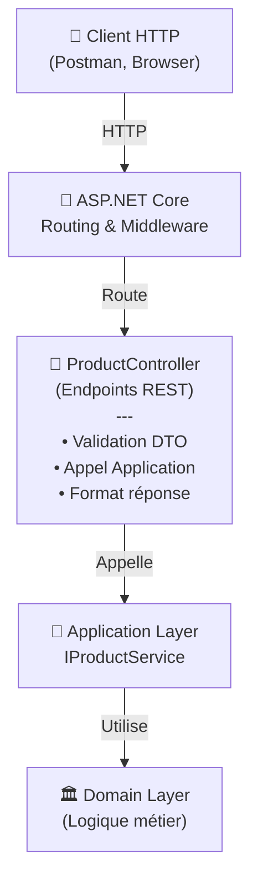

# Documentation Technique - AdvancedDevSample.API

**Version:** 1.0  
**Date:** 28 janvier 2026  
**Couche :** Présentation REST  
**État:** En cours de développement

> ⚠️ **Note** : Ceci est un exercice pédagogique. Pour les concepts métier, voir [Domain Documentation](./02_Domain_Documentation.md).

---

## Table des matières
1. [Introduction](#introduction)
2. [Vue d'ensemble](#vue-densemble)
3. [Endpoints REST](#endpoints-rest)
4. [Modèles de données (DTOs)](#modèles-de-données-dtos)
5. [Gestion d'erreurs](#gestion-derreurs)
6. [Configuration](#configuration)
7. [Annexe](#annexe)

---

## Introduction

### Objectif
L'API **AdvancedDevSample.API** expose une interface REST pour la gestion d'un catalogue de produits. Elle agit comme frontière de la couche présentation, en exposant les fonctionnalités métier de manière standardisée HTTP.

### Responsabilités de cette couche
- ✅ Exposer les endpoints REST
- ✅ Valider les DTOs reçus
- ✅ Orchestrer les appels à la couche Application
- ✅ Formater les réponses HTTP
- ✅ Gérer les codes de statut HTTP
- ✅ Documenter les endpoints (Swagger)

### Responsabilités **NON** de cette couche
- ❌ Implémentation des règles métier (→ [Domain](./02_Domain_Documentation.md))
- ❌ Logique applicative complexe (→ [Application](./03_Application_Documentation.md))
- ❌ Accès aux données (→ [Infrastructure](./04_Infrastructure_Documentation.md))

---

## Vue d'ensemble

### Architecture de la couche API



### Stack technologique

| Composant | Technologie |
|-----------|------------|
| Framework | ASP.NET Core 6.0+ |
| Langage | C# 10+ |
| Sérialisation | System.Text.Json |
| Documentation | Swagger/OpenAPI 3.0 |
| Validation | Data Annotations + Fluent Validation |

### Structure des fichiers

```
AdvancedDevSample.API/
├── Controllers/
│   └── ProductController.cs          (Endpoints REST)
├── Models/
│   ├── Requests/
│   │   ├── CreateProductRequest.cs
│   │   ├── UpdatePriceRequest.cs
│   │   ├── ApplyPromotionRequest.cs
│   │   └── SetStatusRequest.cs
│   └── Responses/
│       ├── ProductResponse.cs
│       ├── PriceResponse.cs
│       └── ErrorResponse.cs
├── Program.cs                        (Configuration)
├── appsettings.json
└── appsettings.Development.json
```

---

## Endpoints REST

### Convention de nommage
- **Ressource** : `/api/products`
- **Singulier pour un item** : `/api/products/{id}`
- **Actions** : `/api/products/{id}/action`

### Conventions de statut HTTP

| Statut | Signification |
|--------|---------------|
| `200 OK` | Succès, retour de données |
| `201 Created` | Ressource créée |
| `204 No Content` | Succès, pas de contenu |
| `400 Bad Request` | Données invalides (client) |
| `404 Not Found` | Ressource inexistante |
| `409 Conflict` | Conflit métier |
| `500 Internal Server Error` | Erreur serveur |

---

## Endpoints disponibles

### 1. Lister tous les produits

```
GET /api/products
```

**Description :** Récupère la liste de tous les produits actifs.

**Paramètres de requête :** Aucun

**Réponse (200 OK) :**
```json
[
  {
    "id": "550e8400-e29b-41d4-a716-446655440000",
    "name": "Produit A",
    "price": 99.99,
    "isActive": true,
    "supplierName": "Acme Corp",
    "taxRate": 0.20
  },
  {
    "id": "660e8400-e29b-41d4-a716-446655440001",
    "name": "Produit B",
    "price": 149.99,
    "isActive": true,
    "supplierName": "TechCorp",
    "taxRate": 0.20
  }
]
```

**Erreurs possibles :**
- `500 Internal Server Error` : Erreur d'accès aux données

---

### 2. Récupérer un produit par ID

```
GET /api/products/{id}
```

**Description :** Affiche les détails complets d'un produit.

**Paramètres :**
- `id` (path) : GUID du produit

**Exemple :**
```
GET /api/products/550e8400-e29b-41d4-a716-446655440000
```

**Réponse (200 OK) :**
```json
{
  "id": "550e8400-e29b-41d4-a716-446655440000",
  "name": "Produit A",
  "description": "Description détaillée du produit",
  "price": 99.99,
  "originalPrice": 99.99,
  "discountApplied": 0,
  "isActive": true,
  "supplier": {
    "id": "660e8400-e29b-41d4-a716-446655440001",
    "name": "Acme Corp",
    "contact": "contact@acme.com"
  },
  "taxRate": 0.20,
  "createdAt": "2026-01-15T10:30:00Z",
  "lastModifiedAt": "2026-01-28T14:00:00Z"
}
```

**Erreurs possibles :**
- `400 Bad Request` : ID invalide (pas un GUID valide)
- `404 Not Found` : Produit inexistant

---

### 3. Modifier le prix d'un produit

```
PUT /api/products/{id}/price
```

**Description :** Met à jour le prix d'un produit existant. Les règles métier sont validées au niveau Domain.

**Paramètres :**
- `id` (path) : GUID du produit

**Corps de la requête :**
```json
{
  "newPrice": 149.99
}
```

**Réponse (200 OK) :**
```json
{
  "id": "550e8400-e29b-41d4-a716-446655440000",
  "price": 149.99,
  "message": "Prix modifié avec succès"
}
```

**Erreurs possibles :**
- `400 Bad Request` : 
  - Prix invalide (≤ 0)
  - Format JSON invalide
- `404 Not Found` : Produit inexistant
- `409 Conflict` : Violation de règle métier

---

### 4. Appliquer une promotion

```
POST /api/products/{id}/apply-promotion
```

**Description :** Applique une réduction promotionnelle sur le prix du produit.

**Paramètres :**
- `id` (path) : GUID du produit

**Corps de la requête :**
```json
{
  "discountPercentage": 15.0,
  "reason": "Solde d'hiver"
}
```

**Réponse (200 OK) :**
```json
{
  "id": "550e8400-e29b-41d4-a716-446655440000",
  "originalPrice": 99.99,
  "discountPercentage": 15.0,
  "priceAfterDiscount": 84.99,
  "promotionAppliedAt": "2026-01-28T14:30:00Z"
}
```

**Erreurs possibles :**
- `400 Bad Request` :
  - Pourcentage invalide (< 0 ou > 100)
  - Format JSON invalide
- `404 Not Found` : Produit inexistant
- `409 Conflict` : Violation de règle métier (prix final invalide)

---

### 5. Modifier le statut d'activation

```
PUT /api/products/{id}/status
```

**Description :** Active ou désactive un produit. Un produit inactif n'apparaît pas dans les listes publiques.

**Paramètres :**
- `id` (path) : GUID du produit

**Corps de la requête :**
```json
{
  "isActive": false
}
```

**Réponse (200 OK) :**
```json
{
  "id": "550e8400-e29b-41d4-a716-446655440000",
  "isActive": false,
  "message": "Statut du produit mis à jour"
}
```

**Erreurs possibles :**
- `400 Bad Request` : Format JSON invalide
- `404 Not Found` : Produit inexistant

---

## Modèles de données (DTOs)

### Requêtes entrantes

#### UpdatePriceRequest
```csharp
public class UpdatePriceRequest
{
    [Range(0.01, double.MaxValue, ErrorMessage = "Le prix doit être > 0")]
    public decimal NewPrice { get; set; }
}
```

#### ApplyPromotionRequest
```csharp
public class ApplyPromotionRequest
{
    [Range(0, 100, ErrorMessage = "Entre 0 et 100")]
    public decimal DiscountPercentage { get; set; }
    
    [StringLength(500)]
    public string? Reason { get; set; }
}
```

#### SetStatusRequest
```csharp
public class SetStatusRequest
{
    public bool IsActive { get; set; }
}
```

### Réponses sortantes

#### ProductResponse
```csharp
public class ProductResponse
{
    public Guid Id { get; set; }
    public string Name { get; set; }
    public string Description { get; set; }
    public decimal Price { get; set; }
    public decimal OriginalPrice { get; set; }
    public decimal DiscountApplied { get; set; }
    public bool IsActive { get; set; }
    public SupplierResponse Supplier { get; set; }
    public decimal TaxRate { get; set; }
    public DateTime CreatedAt { get; set; }
    public DateTime LastModifiedAt { get; set; }
}
```

#### SupplierResponse
```csharp
public class SupplierResponse
{
    public Guid Id { get; set; }
    public string Name { get; set; }
    public string Contact { get; set; }
}
```

#### ErrorResponse
```csharp
public class ErrorResponse
{
    public int StatusCode { get; set; }
    public string Message { get; set; }
    public string ErrorCode { get; set; }
    public Dictionary<string, string[]> Errors { get; set; }
    public DateTime Timestamp { get; set; }
}
```

---

## Gestion d'erreurs

### Codes d'erreur applicatifs

| Code | Message HTTP | Description |
|------|------|-------------|
| `INVALID_PRICE` | 400 Bad Request | Le prix doit être strictement positif |
| `INVALID_DISCOUNT` | 400 Bad Request | Le pourcentage doit être entre 0 et 100 |
| `PRODUCT_NOT_FOUND` | 404 Not Found | Le produit demandé n'existe pas |
| `INVALID_GUID` | 400 Bad Request | L'ID fourni n'est pas un GUID valide |
| `DOMAIN_EXCEPTION` | 409 Conflict | Violation d'une règle métier |
| `DATABASE_ERROR` | 500 Internal Server Error | Erreur d'accès à la base de données |

### Exemple de réponse d'erreur

```json
{
  "statusCode": 400,
  "message": "Validation failed",
  "errorCode": "INVALID_PRICE",
  "errors": {
    "newPrice": [
      "Le prix doit être strictement positif"
    ]
  },
  "timestamp": "2026-01-28T14:35:00Z"
}
```

### Gestion globale des exceptions

Les exceptions sont capturées par un middleware global qui formate les réponses d'erreur de manière cohérente :

```csharp
// Pseudo-code
app.UseExceptionHandler(errorHandlingMiddleware);
```

**Mappages :**
- `DomainException` → 409 Conflict
- `ValidationException` → 400 Bad Request
- `EntityNotFoundException` → 404 Not Found
- Autres exceptions → 500 Internal Server Error

---

## Configuration

### Program.cs

```csharp
var builder = WebApplication.CreateBuilder(args);

// Controllers et Swagger
builder.Services.AddControllers();
builder.Services.AddEndpointsApiExplorer();
builder.Services.AddSwaggerGen(options =>
{
    options.SwaggerDoc("v1", new OpenApiInfo
    {
        Title = "AdvancedDevSample API",
        Version = "v1",
        Description = "API de gestion de catalogue produit"
    });
});

// Injection de dépendances (Application + Infrastructure)
builder.Services.AddScoped<IProductService, ProductService>();
builder.Services.AddScoped<IProductRepository, ProductRepository>();

// Validation personnalisée
builder.Services.AddFluentValidation();

var app = builder.Build();

// Middleware
if (app.Environment.IsDevelopment())
{
    app.UseSwagger();
    app.UseSwaggerUI();
}

app.UseHttpsRedirection();
app.UseAuthorization();
app.UseExceptionHandler(); // Gestion globale des erreurs
app.MapControllers();
app.Run();
```

### appsettings.json

```json
{
  "Logging": {
    "LogLevel": {
      "Default": "Information",
      "Microsoft.AspNetCore": "Warning"
    }
  },
  "AllowedHosts": "*"
}
```

### appsettings.Development.json

```json
{
  "Logging": {
    "LogLevel": {
      "Default": "Debug",
      "Microsoft.AspNetCore": "Information"
    }
  }
}
```

---

## Annexe

### A. Exemples Postman

#### Collection : Products API

**Variables d'environnement :**
```json
{
  "base_url": "https://localhost:5001/api",
  "product_id": "550e8400-e29b-41d4-a716-446655440000"
}
```

**Requête 1 : Lister les produits**
```
GET {{base_url}}/products
```

**Requête 2 : Récupérer un produit**
```
GET {{base_url}}/products/{{product_id}}
```

**Requête 3 : Modifier le prix**
```
PUT {{base_url}}/products/{{product_id}}/price
Content-Type: application/json

{
  "newPrice": 149.99
}
```

**Requête 4 : Appliquer une promotion**
```
POST {{base_url}}/products/{{product_id}}/apply-promotion
Content-Type: application/json

{
  "discountPercentage": 15.0,
  "reason": "Solde saisonnier"
}
```

**Requête 5 : Changer le statut**
```
PUT {{base_url}}/products/{{product_id}}/status
Content-Type: application/json

{
  "isActive": false
}
```

### B. Diagramme d'intégration

```
┌──────────────────┐
│   Client HTTP    │
└────────┬─────────┘
         │
         ↓
┌──────────────────────────────┐
│   ProductController          │
├──────────────────────────────┤
│ - Validation DTO             │
│ - Appel IProductService      │
│ - Formatage réponse          │
└────────┬─────────────────────┘
         │
         ↓
┌──────────────────────────────┐
│   IProductService (port)     │
│   [Application Layer]         │
│   → Voir Documentation App    │
└──────────────────────────────┘
```

### C. Swagger/OpenAPI

L'API expose une documentation interactive via Swagger :
```
GET /swagger/index.html
```

Permet de :
- ✅ Visualiser tous les endpoints
- ✅ Tester les requêtes directement
- ✅ Consulter les schémas de réponse
- ✅ Voir les codes d'erreur

### D. Références

- **[Domain Documentation](./02_Domain_Documentation.md)** - Concepts métier, entités, règles
- **[Application Documentation](./03_Application_Documentation.md)** - Services applicatifs
- **[Infrastructure Documentation](./04_Infrastructure_Documentation.md)** - Accès aux données
- **[INDEX](./INDEX.md)** - Vue d'ensemble et navigation

### E. Checklist de déploiement (API)

- [ ] Program.cs configuré avec tous les services
- [ ] Controllers implémentés avec tous les endpoints
- [ ] DTOs de requête/réponse validés
- [ ] Swagger configuré et documenté
- [ ] Gestion d'erreurs centralisée
- [ ] HTTPS forcé en production
- [ ] Logging configuré
- [ ] CORS configuré si nécessaire
- [ ] Rate limiting configuré (optionnel)
- [ ] Tests d'intégration écrits et passants
- [ ] Documentation mise à jour

---

**Fin de la documentation API**

*Cette documentation décrit uniquement la couche Présentation REST. Pour les détails métier, consulter la [Documentation Domain](./02_Domain_Documentation.md).*
