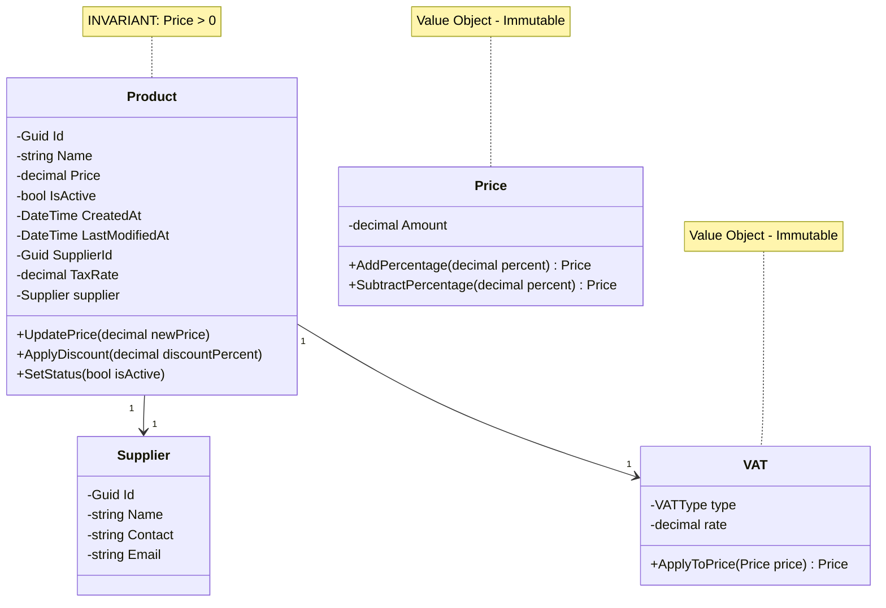

# Documentation Technique - AdvancedDevSample.Domain

**Version:** 1.0  
**Date:** 28 janvier 2026  
**Couche :** Modèle de Domaine (DDD)  
**État:** En cours de développement

> ⚠️ **Note** : Ceci est un exercice pédagogique. Ceci contient le **cœur métier** uniquement, sans détails technique.

---

## Table des matières
1. [Introduction](#introduction)
2. [Concepts métier](#concepts-métier)
3. [Entités](#entités)
4. [Value Objects](#value-objects)
5. [Règles métier](#règles-métier)
6. [Exceptions](#exceptions)
7. [Ports (Interfaces)](#ports-interfaces)
8. [Annexe](#annexe)

---

## Introduction

### Objectif
La couche **Domain** encapsule la logique métier fondamentale du projet AdvancedDevSample. Elle est **indépendante** de toute framework ou technologie.

### Principes appliqués
- 🎯 **Domain-Driven Design (DDD)** : Langage ubiquitaire, agrégats, value objects
- 🔒 **Encapsulation** : La logique métier est protégée
- ✅ **Invariants métier** : Respectés en toutes circonstances
- 🔄 **Ports & Adapters** : Dépendances inversées via interfaces

### Responsabilités
- ✅ Définir les entités du domaine
- ✅ Implémenter les value objects
- ✅ Valider les règles métier
- ✅ Lancer les exceptions métier
- ✅ Définir les ports (interfaces)

### Responsabilités **NON**
- ❌ Exposer des endpoints HTTP (→ [API](./01_API_Documentation.md))
- ❌ Orchestrer les use cases (→ [Application](./03_Application_Documentation.md))
- ❌ Accéder à la base de données (→ [Infrastructure](./04_Infrastructure_Documentation.md))

---

## Concepts métier

### Ubiquitous Language (Langage ubiquitaire)

Vocabulaire métier partagé entre développeurs et métier :

| Terme | Définition |
|-------|-----------|
| **Product** | Article du catalogue vendable |
| **Price** | Valeur monétaire d'un produit, invariant critique |
| **Supplier** | Fournisseur qui approvisionne les produits |
| **VAT** | Taxe sur la valeur ajoutée, variant selon juridiction |
| **Promotion** | Réduction temporaire appliquée au prix |
| **Catalogue** | Ensemble des produits disponibles |
| **Invariant** | Condition qui doit toujours être vraie |

---

## Entités

### Entité : Product (Agrégat Racine)

L'entité **Product** est l'agrégat racine. Elle encapsule :
- Son identité unique
- Son état (prix, activation)
- Ses opérations métier
- La validation de ses invariants

#### Structure

```csharp
public class Product
{
    // Identité
    public Guid Id { get; private set; }
    
    // Données
    public string Name { get; private set; }
    public string Description { get; private set; }
    public decimal Price { get; private set; }  // INVARIANT CRITIQUE
    public bool IsActive { get; private set; }
    
    // Références
    public Guid SupplierId { get; private set; }
    public Supplier Supplier { get; private set; }
    public decimal TaxRate { get; private set; }
    
    // Metadata
    public DateTime CreatedAt { get; private set; }
    public DateTime LastModifiedAt { get; private set; }
}
```

#### Invariants
- `Price > 0` : Le prix doit être strictement positif
- `Price != null` : Le prix doit toujours être défini
- `SupplierId` doit référencer un supplier existant

#### Opérations métier

**UpdatePrice(decimal newPrice)**
```csharp
public void UpdatePrice(decimal newPrice)
{
    // Validation : règle métier "Prix strictement positif"
    if (newPrice <= 0)
        throw new DomainException(
            "Le prix doit être strictement positif",
            "INVALID_PRICE"
        );
    
    // Mutation protégée
    Price = newPrice;
    LastModifiedAt = DateTime.UtcNow;
}
```

**ApplyDiscount(decimal discountPercentage)**
```csharp
public void ApplyDiscount(decimal discountPercentage)
{
    // Validation du pourcentage
    if (discountPercentage < 0 || discountPercentage > 100)
        throw new DomainException(
            "Le pourcentage doit être entre 0 et 100",
            "INVALID_DISCOUNT"
        );
    
    // Calcul du nouveau prix
    decimal discountedPrice = Price * (1 - discountPercentage / 100);
    
    // Assurer l'invariant (utilise UpdatePrice)
    UpdatePrice(discountedPrice);
}
```

**SetStatus(bool isActive)**
```csharp
public void SetStatus(bool isActive)
{
    IsActive = isActive;
    LastModifiedAt = DateTime.UtcNow;
}
```

### Entité : Supplier (Référence externe)

```csharp
public class Supplier
{
    public Guid Id { get; private set; }
    public string Name { get; private set; }
    public string Contact { get; private set; }
    public string Email { get; private set; }
    public DateTime CreatedAt { get; private set; }
}
```

**Invariants :**
- `Name` non vide
- `Email` valide (format email)

---

## Value Objects

### Value Object : Price (Objet Valeur)

Un **value object** est immuable et identifié par sa valeur, pas par son identité.

```csharp
public class Price : IEquatable<Price>
{
    public decimal Amount { get; }
    
    public Price(decimal amount)
    {
        // Validation invariant
        if (amount <= 0)
            throw new DomainException(
                "Le prix doit être strictement positif",
                "INVALID_PRICE"
            );
        
        // Précision monétaire (2 décimales)
        Amount = Math.Round(amount, 2);
    }
    
    // Immuabilité : créer une nouvelle instance
    public Price AddPercentage(decimal percentage)
    {
        decimal newAmount = Amount * (1 + percentage / 100);
        return new Price(newAmount);
    }
    
    public Price SubtractPercentage(decimal percentage)
    {
        decimal newAmount = Amount * (1 - percentage / 100);
        return new Price(newAmount);
    }
    
    // Égalité par valeur
    public bool Equals(Price other)
    {
        return other != null && Amount == other.Amount;
    }
    
    public override bool Equals(object obj)
    {
        return Equals(obj as Price);
    }
    
    public override int GetHashCode()
    {
        return Amount.GetHashCode();
    }
    
    public override string ToString()
    {
        return $"{Amount:C}";
    }
}
```

**Caractéristiques :**
- ✅ Immuable : une fois créé, ne change pas
- ✅ Validé à la création : garantit invariants
- ✅ Égalité par valeur : deux Price(100) == Price(100)
- ✅ Auto-contenu : encapsule la logique de prix

### Value Object : VAT (Taxe)

```csharp
public class VAT : IEquatable<VAT>
{
    public enum VATType
    {
        Standard = 20,      // 20%
        Reduced = 10,       // 10%
        SuperReduced = 5,   // 5%
        Exempt = 0          // 0%
    }
    
    public VATType Type { get; }
    public decimal Rate { get; }
    
    public VAT(VATType type)
    {
        Type = type;
        Rate = (decimal)type / 100;
    }
    
    public Price ApplyToPrice(Price basePrice)
    {
        decimal taxedAmount = basePrice.Amount * (1 + Rate);
        return new Price(taxedAmount);
    }
    
    public bool Equals(VAT other)
    {
        return other != null && Type == other.Type;
    }
    
    public override bool Equals(object obj)
    {
        return Equals(obj as VAT);
    }
    
    public override int GetHashCode()
    {
        return Type.GetHashCode();
    }
}
```

---

## Règles métier

### Règle 1 : Prix strictement positif (Priorité CRITIQUE)

```
∀ Product p : p.Price > 0
```

**Énoncé :**  
Un produit ne peut **jamais** avoir un prix négatif, zéro ou null. C'est un invariant immuable.

**Quand elle s'applique :**
- ✅ Création d'un produit
- ✅ Modification du prix
- ✅ Application d'une promotion
- ✅ Annulation d'une promotion

**Implémentation :**
```csharp
public void UpdatePrice(decimal newPrice)
{
    if (newPrice <= 0)
        throw new DomainException("Le prix doit être > 0", "INVALID_PRICE");
    
    Price = newPrice;
}
```

**Cas limite :**
```
Situation: Appliquer 50% de réduction sur un produit à 100€
Calcul: 100 * (1 - 50/100) = 50€ ✅ Valide
```

```
Situation: Appliquer 100% de réduction sur un produit à 100€
Calcul: 100 * (1 - 100/100) = 0€ ❌ EXCEPTION levée
```

---

### Règle 2 : Produit toujours avec prix valide (Priorité HAUTE)

```
∀ Product p : p.Price est défini ∧ p.Price respecte Règle 1
```

**Énoncé :**  
Tout produit existant doit posséder un prix valide. Un produit ne peut pas être créé sans prix. Un produit sans prix ne peut pas être sauvegardé.

**Quand elle s'applique :**
- ✅ Validation avant sauvegarde
- ✅ Validation avant retour au client
- ✅ Validation lors de la création

**Implémentation :**
```csharp
public class Product
{
    // Le Price n'est jamais null en raison de la Règle 1
    public decimal Price { get; private set; }
    
    // Constructeur sans price = pas autorisé
    // Constructeur avec price invalide = exception levée
    public Product(Guid id, decimal price, ...)
    {
        // Validation implicite via UpdatePrice
        UpdatePrice(price);
    }
}
```

---

### Règle 3 : Invariant de prix (Priorité CRITIQUE)

```
Invariant(Price) : 
  - Price > 0
  - Price ≠ null
  - Price reste valide après chaque mutation
  - Price ne peut être modifié que via méthodes publiques validées
```

**Énoncé :**  
Le prix est un **invariant critique du domaine**. Il ne doit jamais être dans un état invalide, même temporairement. Toute mutation doit :
1. Valider la nouvelle valeur
2. Lever exception si invalide
3. Mettre à jour atomiquement

**Implémentation :**
```csharp
public class Product
{
    // Stockage privé : immuable de l'extérieur
    private decimal _price;
    
    public decimal Price 
    { 
        get => _price; 
        private set => _price = value;  // Setter privé uniquement
    }
    
    // SEULE façon de modifier le prix
    public void UpdatePrice(decimal newPrice)
    {
        // 1. Valider
        if (newPrice <= 0)
            throw new DomainException("Prix invalide");
        
        // 2. Mutation atomique (pas d'état intermédiaire invalide)
        Price = newPrice;
        LastModifiedAt = DateTime.UtcNow;
    }
}
```

**Garanties :**
- ✅ Invariant toujours respecté
- ✅ Pas d'état demi-invalide possible
- ✅ Traçabilité des modifications (LastModifiedAt)
- ✅ Atomic: tout ou rien

---

### Règle 4 : État d'activation (Priorité MOYENNE)

```
∀ Product p : p.IsActive ∈ {true, false}
```

**Énoncé :**  
Un produit peut être actif (`true`) ou inactif (`false`). Un produit inactif :
- ❌ N'apparaît pas dans les listes publiques
- ✅ Peut avoir son prix modifié (admin)
- ✅ Conserve ses données historiques

**Quand elle s'applique :**
- ✅ Filtrage des listes de produits
- ✅ Visibilité des produits
- ✅ Modification des prix

**Implémentation :**
```csharp
public void SetStatus(bool isActive)
{
    IsActive = isActive;
    // Pas de restriction sur les modifications si inactif
}

// Filtre au niveau du repository
public Task<IEnumerable<Product>> GetAllActiveAsync()
{
    return _context.Products
        .Where(p => p.IsActive)
        .ToListAsync();
}
```

---

### Règle 5 : Promotion valide (Priorité HAUTE)

```
∀ Promotion promo : 
  - 0 ≤ promo.DiscountPercentage ≤ 100
  - promo.FinalPrice > 0 (Règle 1 après application)
```

**Énoncé :**  
Les promotions modifient le prix de manière cohérente :
- Réduction entre 0% et 100%
- Le prix final doit respecter la Règle 1 (> 0)
- Pas de réduction jusqu'à 0€ ou négatif

**Quand elle s'applique :**
- ✅ Application de réduction
- ✅ Validation du pourcentage

**Implémentation :**
```csharp
public void ApplyDiscount(decimal discountPercentage)
{
    // 1. Valider pourcentage
    if (discountPercentage < 0 || discountPercentage > 100)
        throw new DomainException("Pourcentage invalide");
    
    // 2. Calculer nouveau prix
    decimal newPrice = Price * (1 - discountPercentage / 100);
    
    // 3. Valider Règle 1 (via UpdatePrice)
    UpdatePrice(newPrice);  // Levera exception si newPrice <= 0
}
```

**Exemple :**
```
Produit prix 100€, appliquer 50% réduction:
  100 * (1 - 50/100) = 50€ ✅ Valide

Produit prix 10€, appliquer 95% réduction:
  10 * (1 - 95/100) = 0.50€ ✅ Valide

Produit prix 10€, appliquer 99% réduction:
  10 * (1 - 99/100) = 0.10€ ✅ Valide

Produit prix 10€, appliquer 100% réduction:
  10 * (1 - 100/100) = 0€ ❌ EXCEPTION (Règle 1)
```

---

## Exceptions

### DomainException (Exception métier)

```csharp
public class DomainException : Exception
{
    public string ErrorCode { get; set; }
    
    public DomainException(string message, string errorCode = "DOMAIN_ERROR")
        : base(message)
    {
        ErrorCode = errorCode;
    }
}
```

**Cas d'usage :**
```csharp
// Cas 1: Prix invalide
throw new DomainException(
    "Le prix doit être strictement positif",
    "INVALID_PRICE"
);

// Cas 2: Promotion invalide
throw new DomainException(
    "Le pourcentage doit être entre 0 et 100",
    "INVALID_DISCOUNT"
);
```

### EntityNotFoundException (Entité non trouvée)

```csharp
public class EntityNotFoundException : Exception
{
    public EntityNotFoundException(string entityName, Guid id)
        : base($"{entityName} avec l'ID {id} n'a pas été trouvé")
    {
    }
}
```

**Cas d'usage (Application layer) :**
```csharp
var product = await _repository.GetByIdAsync(id);
if (product == null)
    throw new EntityNotFoundException("Product", id);
```

---

## Ports (Interfaces)

### IProductRepository (Port)

```csharp
namespace AdvancedDevSample.Domain.Interfaces
{
    /// <summary>
    /// Port : Abstraction de persistance pour les produits.
    /// À implémenter par la couche Infrastructure.
    /// </summary>
    public interface IProductRepository
    {
        // Requêtes
        Task<Product> GetByIdAsync(Guid id);
        Task<IEnumerable<Product>> GetAllAsync();
        Task<IEnumerable<Product>> GetAllActiveAsync();
        
        // Commandes
        Task AddAsync(Product product);
        Task UpdateAsync(Product product);
        Task DeleteAsync(Guid id);
    }
}
```

**Responsabilités :**
- ✅ Récupérer les produits
- ✅ Persister les modifications
- ❌ N'implémente PAS la logique métier

**Implémentation :** [Infrastructure Documentation](./04_Infrastructure_Documentation.md)

---

## Annexe

### A. Diagramme du modèle de domaine



### B. Tableau des invariants

| Invariant | Type | Niveau | Vérification |
|-----------|------|--------|--------------|
| `Price > 0` | Domain | CRITIQUE | À chaque mutation |
| `Price != null` | Domain | HAUTE | À la création |
| `IsActive in {true, false}` | Domain | BASSE | À la création |
| `SupplierId valide` | Domain | MOYENNE | À la sauvegarde |

### C. Matrice Règles × Opérations

|  | Création | Update Price | Apply Discount | Set Status |
|---|---|---|---|---|
| Règle 1 (Prix > 0) | ✅ Vérifie | ✅ Vérifie | ✅ Vérifie | ✅ Inchangé |
| Règle 2 (Prix défini) | ✅ Impose | ✅ Mantient | ✅ Mantient | ✅ Inchangé |
| Règle 3 (Invariant) | ✅ Établit | ✅ Respecte | ✅ Respecte | ✅ Inchangé |
| Règle 4 (Status) | ✅ Active | ✅ Pas de limite | ✅ Pas de limite | ✅ Modifie |
| Règle 5 (Promotion) | ❌ N/A | ❌ N/A | ✅ Valide | ❌ N/A |

### D. Glossaire

| Terme | Définition |
|-------|-----------|
| **Agrégat** | Groupe d'objets traité comme une unité |
| **Racine d'agrégat** | Entité principale d'un agrégat (Product) |
| **Value Object** | Objet immuable identifié par sa valeur (Price) |
| **Entity** | Objet avec identité unique |
| **Invariant** | Condition toujours vraie |
| **Port** | Interface abstraite (pas de détails techniques) |
| **Ubiquitous Language** | Langage partagé métier-dev |

### E. Références

- **[Application Documentation](./03_Application_Documentation.md)** - Orchestration des use cases
- **[Infrastructure Documentation](./04_Infrastructure_Documentation.md)** - Implémentation des repositories
- **[API Documentation](./01_API_Documentation.md)** - Exposition REST
- **[INDEX](./INDEX.md)** - Vue d'ensemble du projet

---

**Fin de la documentation Domain**

*Le Domain est le cœur du projet. Protégez ses invariants. 🛡️*
