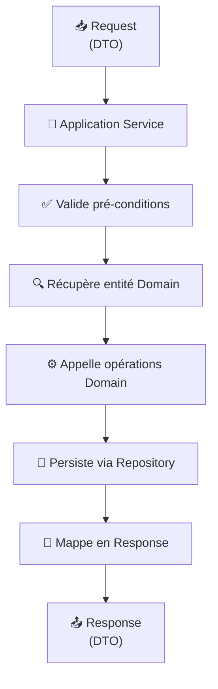
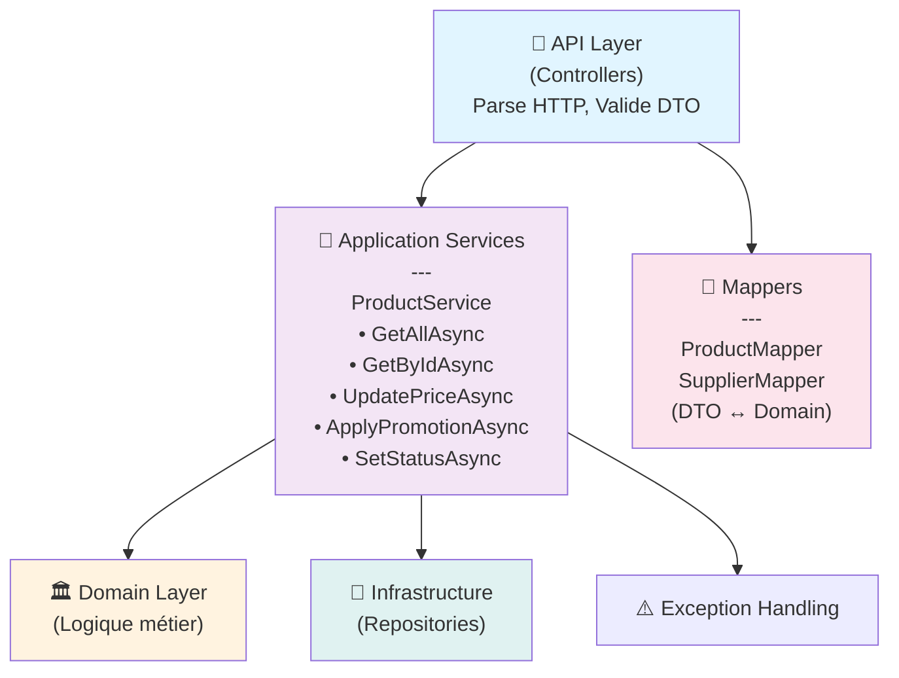

# Documentation Technique - AdvancedDevSample.Application

**Version:** 1.0  
**Date:** 28 janvier 2026  
**Couche :** Application (Orchestration des Use Cases)  
**État:** En cours de développement

> ⚠️ **Note** : Ceci est un exercice pédagogique. Cette couche orchestre les use cases métier.

---

## Table des matières
1. [Introduction](#introduction)
2. [Vue d'ensemble](#vue-densemble)
3. [Services applicatifs](#services-applicatifs)
4. [Use Cases](#use-cases)
5. [DTOs (Data Transfer Objects)](#dtos-data-transfer-objects)
6. [Mappage Domain → DTOs](#mappage-domain--dtos)
7. [Gestion des erreurs](#gestion-des-erreurs)
8. [Annexe](#annexe)

---

## Introduction

### Objectif
La couche **Application** orchestre les cas d'usage (use cases) du système. Elle :
- Récupère les domaines depuis les repositories
- Applique les opérations métier
- Retourne les résultats au client
- Traduit entre le domaine et les DTOs

### Responsabilités
- ✅ Orchestrer les use cases
- ✅ Valider les pré-conditions
- ✅ Appeler les services de domaine
- ✅ Mapper Domain → DTOs
- ✅ Gérer les transactions
- ✅ Traduire les exceptions métier

### Responsabilités **NON**
- ❌ Logique métier complexe (→ [Domain](./02_Domain_Documentation.md))
- ❌ Exposition HTTP (→ [API](./01_API_Documentation.md))
- ❌ Accès direct à la BD (→ [Infrastructure](./04_Infrastructure_Documentation.md))

### Pattern appliqué : Application Service



---

## Vue d'ensemble

### Architecture de la couche Application



### Structure des fichiers

```
AdvancedDevSample.Application/
├── Services/
│   ├── ProductService.cs           (Application Service)
│   └── Interfaces/
│       └── IProductService.cs      (Port)
├── DTOs/
│   ├── Products/
│   │   ├── ProductDto.cs
│   │   ├── CreateProductDto.cs
│   │   ├── UpdatePriceDto.cs
│   │   └── ApplyPromotionDto.cs
│   └── Common/
│       └── BaseDto.cs
├── Mappers/
│   ├── ProductMapper.cs
│   └── IMapper.cs
└── Exceptions/
    ├── ApplicationException.cs
    └── ValidationException.cs
```

---

## Services applicatifs

### IProductService (Port/Interface)

```csharp
namespace AdvancedDevSample.Application.Services
{
    /// <summary>
    /// Port: Service applicatif pour orchestrer les use cases produit.
    /// Cette interface est implémentée dans cette couche.
    /// </summary>
    public interface IProductService
    {
        // Use Case 1: Lister les produits
        Task<IEnumerable<ProductDto>> GetAllAsync();
        
        // Use Case 2: Afficher les détails d'un produit
        Task<ProductDto> GetByIdAsync(Guid id);
        
        // Use Case 3: Modifier le prix
        Task<ProductDto> UpdatePriceAsync(Guid id, decimal newPrice);
        
        // Use Case 4: Appliquer une promotion
        Task<ProductDto> ApplyPromotionAsync(Guid id, decimal discountPercentage);
        
        // Use Case 5: Modifier le statut
        Task<ProductDto> SetStatusAsync(Guid id, bool isActive);
    }
}
```

### ProductService (Implémentation)

```csharp
namespace AdvancedDevSample.Application.Services
{
    public class ProductService : IProductService
    {
        private readonly IProductRepository _repository;
        private readonly IProductMapper _mapper;
        private readonly ILogger<ProductService> _logger;
        
        public ProductService(
            IProductRepository repository,
            IProductMapper mapper,
            ILogger<ProductService> logger)
        {
            _repository = repository;
            _mapper = mapper;
            _logger = logger;
        }
        
        /// <summary>
        /// UC1: Récupère tous les produits actifs.
        /// </summary>
        public async Task<IEnumerable<ProductDto>> GetAllAsync()
        {
            _logger.LogInformation("Récupération de tous les produits");
            
            try
            {
                // Récupère via repository (infrastructure)
                var products = await _repository.GetAllActiveAsync();
                
                // Mappe en DTOs
                var dtos = products.Select(p => _mapper.MapToDto(p));
                
                _logger.LogInformation($"{dtos.Count()} produits récupérés");
                return dtos;
            }
            catch (Exception ex)
            {
                _logger.LogError(ex, "Erreur lors de la récupération des produits");
                throw new ApplicationException(
                    "Impossible de récupérer les produits",
                    ex);
            }
        }
        
        /// <summary>
        /// UC2: Récupère un produit par son ID.
        /// </summary>
        public async Task<ProductDto> GetByIdAsync(Guid id)
        {
            _logger.LogInformation($"Récupération du produit {id}");
            
            // Validation pré-condition
            if (id == Guid.Empty)
                throw new ApplicationException("L'ID du produit est invalide");
            
            try
            {
                // Récupère via repository
                var product = await _repository.GetByIdAsync(id);
                
                // Vérifie l'existence
                if (product == null)
                    throw new EntityNotFoundException("Product", id);
                
                // Mappe en DTO
                return _mapper.MapToDto(product);
            }
            catch (EntityNotFoundException)
            {
                throw;  // Remonte au caller
            }
            catch (Exception ex)
            {
                _logger.LogError(ex, $"Erreur lors de la récupération du produit {id}");
                throw new ApplicationException(
                    "Impossible de récupérer le produit",
                    ex);
            }
        }
        
        /// <summary>
        /// UC3: Modifie le prix d'un produit.
        /// 
        /// Flux:
        /// 1. Valide pré-conditions
        /// 2. Récupère le produit
        /// 3. Appelle product.UpdatePrice() (Domain)
        /// 4. Persiste via repository
        /// 5. Mappe et retourne
        /// </summary>
        public async Task<ProductDto> UpdatePriceAsync(Guid id, decimal newPrice)
        {
            _logger.LogInformation($"Modification du prix du produit {id} à {newPrice}");
            
            // Validation pré-conditions
            if (id == Guid.Empty)
                throw new ApplicationException("L'ID du produit est invalide");
            
            if (newPrice <= 0)
                throw new ApplicationException(
                    "Le prix doit être strictement positif",
                    "INVALID_PRICE");
            
            try
            {
                // 1. Récupère l'entité Domain
                var product = await _repository.GetByIdAsync(id);
                if (product == null)
                    throw new EntityNotFoundException("Product", id);
                
                // 2. Appelle l'opération métier (Domain)
                // Cette méthode valide les invariants
                product.UpdatePrice(newPrice);
                
                // 3. Persiste
                await _repository.UpdateAsync(product);
                
                _logger.LogInformation($"Prix du produit {id} mis à jour à {newPrice}");
                
                // 4. Mappe et retourne
                return _mapper.MapToDto(product);
            }
            catch (DomainException ex)
            {
                _logger.LogWarning(ex, $"Violation métier: {ex.ErrorCode}");
                throw new ApplicationException(ex.Message, ex.ErrorCode, ex);
            }
            catch (EntityNotFoundException)
            {
                throw;  // Remonte
            }
            catch (Exception ex)
            {
                _logger.LogError(ex, $"Erreur lors de la modification du prix");
                throw new ApplicationException(
                    "Impossible de modifier le prix",
                    ex);
            }
        }
        
        /// <summary>
        /// UC4: Applique une promotion (réduction de pourcentage).
        /// 
        /// Flux:
        /// 1. Valide pré-conditions (pourcentage, produit existe)
        /// 2. Récupère le produit
        /// 3. Appelle product.ApplyDiscount() (Domain)
        /// 4. Persiste
        /// 5. Retourne le résultat
        /// </summary>
        public async Task<ProductDto> ApplyPromotionAsync(
            Guid id,
            decimal discountPercentage)
        {
            _logger.LogInformation(
                $"Application d'une réduction de {discountPercentage}% au produit {id}");
            
            // Validation pré-conditions
            if (id == Guid.Empty)
                throw new ApplicationException("L'ID du produit est invalide");
            
            if (discountPercentage < 0 || discountPercentage > 100)
                throw new ApplicationException(
                    "Le pourcentage doit être entre 0 et 100",
                    "INVALID_DISCOUNT");
            
            try
            {
                // 1. Récupère l'entité Domain
                var product = await _repository.GetByIdAsync(id);
                if (product == null)
                    throw new EntityNotFoundException("Product", id);
                
                // 2. Appelle l'opération métier
                // Valide aussi la Règle 1 (prix > 0 après réduction)
                product.ApplyDiscount(discountPercentage);
                
                // 3. Persiste
                await _repository.UpdateAsync(product);
                
                _logger.LogInformation(
                    $"Réduction de {discountPercentage}% appliquée au produit {id}");
                
                // 4. Retourne
                return _mapper.MapToDto(product);
            }
            catch (DomainException ex)
            {
                _logger.LogWarning(ex, $"Violation métier: {ex.ErrorCode}");
                throw new ApplicationException(ex.Message, ex.ErrorCode, ex);
            }
            catch (EntityNotFoundException)
            {
                throw;
            }
            catch (Exception ex)
            {
                _logger.LogError(ex, "Erreur lors de l'application de la promotion");
                throw new ApplicationException(
                    "Impossible d'appliquer la promotion",
                    ex);
            }
        }
        
        /// <summary>
        /// UC5: Modifie le statut d'activation d'un produit.
        /// </summary>
        public async Task<ProductDto> SetStatusAsync(Guid id, bool isActive)
        {
            _logger.LogInformation(
                $"Modification du statut du produit {id} à {isActive}");
            
            // Validation pré-conditions
            if (id == Guid.Empty)
                throw new ApplicationException("L'ID du produit est invalide");
            
            try
            {
                // 1. Récupère l'entité
                var product = await _repository.GetByIdAsync(id);
                if (product == null)
                    throw new EntityNotFoundException("Product", id);
                
                // 2. Appelle l'opération métier
                product.SetStatus(isActive);
                
                // 3. Persiste
                await _repository.UpdateAsync(product);
                
                _logger.LogInformation($"Statut du produit {id} mis à jour");
                
                // 4. Retourne
                return _mapper.MapToDto(product);
            }
            catch (EntityNotFoundException)
            {
                throw;
            }
            catch (Exception ex)
            {
                _logger.LogError(ex, "Erreur lors de la modification du statut");
                throw new ApplicationException(
                    "Impossible de modifier le statut",
                    ex);
            }
        }
    }
}
```

---

## Use Cases

### UC1: Lister tous les produits

```
Titre: Lister tous les produits
Acteur: Client API
Pré-conditions: -
Flux normal:
  1. Service appelle repository.GetAllActiveAsync()
  2. Repository retourne une liste de produits
  3. Service mappe chaque produit en DTO
  4. Service retourne la liste de DTOs
Post-condition: Client reçoit une liste de ProductDto[]
Exceptions:
  - DatabaseException → ApplicationException
```

**Service Code:**
```csharp
public async Task<IEnumerable<ProductDto>> GetAllAsync()
{
    var products = await _repository.GetAllActiveAsync();
    return products.Select(p => _mapper.MapToDto(p)).ToList();
}
```

---

### UC2: Afficher un produit

```
Titre: Afficher les détails d'un produit
Acteur: Client API
Pré-conditions:
  - id est un GUID valide
Flux normal:
  1. Service valide l'ID
  2. Service appelle repository.GetByIdAsync(id)
  3. Repository retourne le produit
  4. Service mappe le produit en DTO
  5. Service retourne le DTO
Post-condition: Client reçoit un ProductDto avec tous les détails
Flux alternatif:
  - Si produit n'existe pas → EntityNotFoundException
  - Si ID invalide → ApplicationException
Exceptions:
  - EntityNotFoundException
  - ApplicationException
```

**Service Code:**
```csharp
public async Task<ProductDto> GetByIdAsync(Guid id)
{
    if (id == Guid.Empty)
        throw new ApplicationException("L'ID est invalide");
    
    var product = await _repository.GetByIdAsync(id);
    if (product == null)
        throw new EntityNotFoundException("Product", id);
    
    return _mapper.MapToDto(product);
}
```

---

### UC3: Modifier le prix

```
Titre: Modifier le prix d'un produit
Acteur: Admin/API
Pré-conditions:
  - Produit existe
  - Nouveau prix > 0 (Règle métier)
Flux normal:
  1. Service valide pré-conditions
  2. Service récupère le produit
  3. Service appelle product.UpdatePrice(newPrice)
  4. product.UpdatePrice valide l'invariant (Domain)
  5. Service persiste via repository
  6. Service mappe et retourne le produit modifié
Post-condition: Prix modifié, persisted, produit retourné
Flux alternatif:
  - Prix ≤ 0 → DomainException (puis ApplicationException)
  - Produit n'existe pas → EntityNotFoundException
Exceptions levées:
  - DomainException ("INVALID_PRICE")
  - EntityNotFoundException
  - ApplicationException
```

**Diagramme de séquence:**
```
Client          Controller        ProductService    Product    Repository
  │                 │                 │               │           │
  │─ PUT /price ────→│                 │               │           │
  │                 │─ UpdatePrice ───→│               │           │
  │                 │                 │ validate price │           │
  │                 │                 │ price > 0? ───→│           │
  │                 │                 │ ✓ OK ←─────────│           │
  │                 │                 │ price = value  │           │
  │                 │                 │                │           │
  │                 │                 │ save ─────────→│           │
  │                 │                 │                │ persist   │
  │                 │                 │                │─ save ───→│
  │                 │                 │                │ ← OK ─────│
  │                 │                 │ ← Success ─────│           │
  │                 │ ← ProductDto ────│                │           │
  │ ← 200 OK ───────│                 │                │           │
```

---

### UC4: Appliquer une promotion

```
Titre: Appliquer une réduction promotionnelle
Acteur: Admin/API
Pré-conditions:
  - Produit existe
  - Pourcentage entre 0 et 100
  - Prix final > 0 (après réduction)
Flux normal:
  1. Service valide pré-conditions
  2. Service récupère le produit
  3. Service appelle product.ApplyDiscount(percentage)
  4. product.ApplyDiscount calcule: newPrice = price * (1 - %/100)
  5. product.ApplyDiscount appelle UpdatePrice(newPrice)
  6. UpdatePrice valide newPrice > 0 (invariant)
  7. Service persiste
  8. Service retourne le produit
Post-condition: Promotion appliquée et persistée
Flux alternatif:
  - Pourcentage invalide → ApplicationException
  - Prix final ≤ 0 → DomainException (règle 1)
  - Produit n'existe pas → EntityNotFoundException
Exceptions:
  - ApplicationException ("INVALID_DISCOUNT")
  - DomainException ("INVALID_PRICE")
  - EntityNotFoundException
```

---

### UC5: Modifier le statut

```
Titre: Activer ou désactiver un produit
Acteur: Admin/API
Pré-conditions:
  - Produit existe
Flux normal:
  1. Service valide l'ID
  2. Service récupère le produit
  3. Service appelle product.SetStatus(isActive)
  4. product.SetStatus met à jour IsActive
  5. Service persiste
  6. Service retourne le produit
Post-condition: Statut modifié et persisted
Exceptions:
  - EntityNotFoundException
  - ApplicationException
```

---

## DTOs (Data Transfer Objects)

### Concept

Les DTOs sont des **objets de transfert de données** :
- ✅ Séparent le Domain de l'API
- ✅ Définissent quelles données exposer
- ✅ Facilitent le mappage
- ✅ Protègent le Domain de changements API

```
Domain (interno)  ←mapper→  DTO (externe)
Product                      ProductDto
  +Price                      +Price
  +IsActive                   +IsActive
  +SupplierId                 +SupplierName (transformé)
  +TaxRate                    (pas l'ID interne)
  +private methods            (juste des données)
```

### ProductDto

```csharp
namespace AdvancedDevSample.Application.DTOs.Products
{
    /// <summary>
    /// DTO de réponse pour les produits.
    /// Représente l'état public d'un produit.
    /// </summary>
    public class ProductDto
    {
        public Guid Id { get; set; }
        public string Name { get; set; }
        public string Description { get; set; }
        
        // Prix
        public decimal Price { get; set; }
        public decimal OriginalPrice { get; set; }
        public decimal DiscountApplied { get; set; }
        
        // Statut
        public bool IsActive { get; set; }
        
        // Informations additionnelles
        public SupplierDto Supplier { get; set; }
        public decimal TaxRate { get; set; }
        
        // Métadonnées
        public DateTime CreatedAt { get; set; }
        public DateTime LastModifiedAt { get; set; }
    }
}
```

### CreateProductDto

```csharp
public class CreateProductDto
{
    [Required]
    [StringLength(200, MinimumLength = 3)]
    public string Name { get; set; }
    
    [Required]
    [StringLength(1000)]
    public string Description { get; set; }
    
    [Required]
    [Range(0.01, double.MaxValue)]
    public decimal Price { get; set; }
    
    [Required]
    public Guid SupplierId { get; set; }
    
    [Range(0, 100)]
    public decimal TaxRate { get; set; }
}
```

### UpdatePriceDto

```csharp
public class UpdatePriceDto
{
    [Required]
    [Range(0.01, double.MaxValue, 
        ErrorMessage = "Le prix doit être > 0")]
    public decimal NewPrice { get; set; }
}
```

### ApplyPromotionDto

```csharp
public class ApplyPromotionDto
{
    [Required]
    [Range(0, 100, 
        ErrorMessage = "Entre 0 et 100")]
    public decimal DiscountPercentage { get; set; }
    
    [StringLength(500)]
    public string Reason { get; set; }
}
```

### SupplierDto

```csharp
public class SupplierDto
{
    public Guid Id { get; set; }
    public string Name { get; set; }
    public string Contact { get; set; }
    public string Email { get; set; }
}
```

---

## Mappage Domain ↔ DTOs

### IProductMapper (Interface)

```csharp
namespace AdvancedDevSample.Application.Mappers
{
    public interface IProductMapper
    {
        // Domain → DTO
        ProductDto MapToDto(Product product);
        IEnumerable<ProductDto> MapToDtoList(IEnumerable<Product> products);
        
        // DTO → Domain (pour création/édition)
        Product MapToDomain(CreateProductDto dto);
    }
}
```

### ProductMapper (Implémentation)

```csharp
namespace AdvancedDevSample.Application.Mappers
{
    public class ProductMapper : IProductMapper
    {
        private readonly ISupplierMapper _supplierMapper;
        
        public ProductMapper(ISupplierMapper supplierMapper)
        {
            _supplierMapper = supplierMapper;
        }
        
        /// <summary>
        /// Mappe une entité Domain (Product) en DTO (ProductDto)
        /// </summary>
        public ProductDto MapToDto(Product product)
        {
            if (product == null)
                return null;
            
            return new ProductDto
            {
                Id = product.Id,
                Name = product.Name,
                Description = product.Description,
                Price = product.Price,
                OriginalPrice = product.OriginalPrice,
                DiscountApplied = CalculateDiscount(
                    product.OriginalPrice,
                    product.Price),
                IsActive = product.IsActive,
                Supplier = _supplierMapper.MapToDto(product.Supplier),
                TaxRate = product.TaxRate,
                CreatedAt = product.CreatedAt,
                LastModifiedAt = product.LastModifiedAt
            };
        }
        
        public IEnumerable<ProductDto> MapToDtoList(IEnumerable<Product> products)
        {
            return products?.Select(MapToDto) ?? Enumerable.Empty<ProductDto>();
        }
        
        /// <summary>
        /// Mappe un DTO de création en entité Domain
        /// </summary>
        public Product MapToDomain(CreateProductDto dto)
        {
            if (dto == null)
                return null;
            
            // Validation basique (validation avancée au Domain)
            if (dto.Price <= 0)
                throw new ApplicationException(
                    "Le prix doit être > 0",
                    "INVALID_PRICE");
            
            return new Product(
                Guid.NewGuid(),
                dto.Name,
                dto.Description,
                dto.Price,
                dto.SupplierId,
                dto.TaxRate,
                isActive: true
            );
        }
        
        private decimal CalculateDiscount(decimal original, decimal current)
        {
            if (original == 0)
                return 0;
            
            return (original - current) / original * 100;
        }
    }
}
```

---

## Gestion des erreurs

### ApplicationException

```csharp
namespace AdvancedDevSample.Application.Exceptions
{
    public class ApplicationException : Exception
    {
        public string ErrorCode { get; set; }
        public Exception InnerException { get; set; }
        
        public ApplicationException(
            string message,
            string errorCode = "APPLICATION_ERROR",
            Exception innerException = null)
            : base(message, innerException)
        {
            ErrorCode = errorCode;
            InnerException = innerException;
        }
    }
}
```

### EntityNotFoundException

```csharp
namespace AdvancedDevSample.Application.Exceptions
{
    public class EntityNotFoundException : ApplicationException
    {
        public EntityNotFoundException(string entityName, Guid id)
            : base(
                $"{entityName} avec l'ID {id} n'a pas été trouvé",
                "ENTITY_NOT_FOUND")
        {
        }
    }
}
```

### Mappage Exceptions

| Exception (Domain) | Exception (Application) | Code HTTP |
|---|---|---|
| `DomainException` | `ApplicationException` | 409 |
| `(null result)` | `EntityNotFoundException` | 404 |
| `ValidationException` | `ApplicationException` | 400 |
| Autres exceptions | `ApplicationException` | 500 |

---

## Annexe

### A. Flux de dépendances

```
API Controller
    ↓ injecte
IProductService
    ├─ utilise → IProductRepository (Infrastructure)
    ├─ utilise → IProductMapper
    └─ appelle → Product (Domain)
```

### B. Injection de dépendances

```csharp
// Program.cs
builder.Services.AddScoped<IProductService, ProductService>();
builder.Services.AddScoped<IProductMapper, ProductMapper>();
builder.Services.AddScoped<IProductRepository, ProductRepository>();
```

### C. Checklist de déploiement (Application)

- [ ] Services applicatifs implémentés pour tous les use cases
- [ ] DTOs définis et validés
- [ ] Mappers Domain ↔ DTO implémentés
- [ ] Gestion d'erreurs centralisée
- [ ] Logging configuré
- [ ] Injection des dépendances en place
- [ ] Tests unitaires > 80% coverage
- [ ] Tests d'intégration écrits
- [ ] Documentation mise à jour

### D. Glossaire

| Terme | Définition |
|-------|-----------|
| **Use Case** | Scénario d'utilisation du système |
| **Application Service** | Orchestre un use case |
| **DTO** | Objet de transfert de données |
| **Mapper** | Convertit entre Domain et DTO |
| **Port** | Interface abstraite (implémentée ici) |

### E. Références

- **[Domain Documentation](./02_Domain_Documentation.md)** - Entités et règles métier
- **[Infrastructure Documentation](./04_Infrastructure_Documentation.md)** - Repositories
- **[API Documentation](./01_API_Documentation.md)** - Controllers et endpoints
- **[INDEX](./INDEX.md)** - Vue d'ensemble

---

**Fin de la documentation Application**

*L'Application orchestre. Le Domain valide. L'Infrastructure persiste. 🔄*
