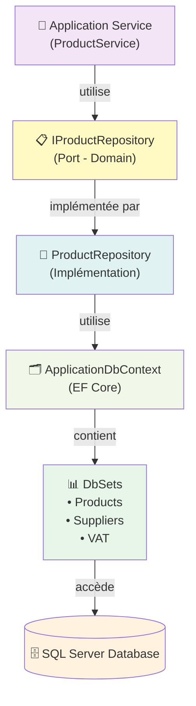

# Documentation Technique - AdvancedDevSample.Infrastructure

**Version:** 1.0  
**Date:** 28 janvier 2026  
**Couche :** Infrastructure (Persistance & Accès aux Données)  
**État:** En cours de développement

> ⚠️ **Note** : Ceci est un exercice pédagogique. Cette couche implémente les détails techniques de persistance.

---

## Table des matières
1. [Introduction](#introduction)
2. [Vue d'ensemble](#vue-densemble)
3. [Repositories](#repositories)
4. [Entity Framework Core](#entity-framework-core)
5. [DbContext](#dbcontext)
6. [Migrations](#migrations)
7. [Configuration](#configuration)
8. [Patterns](#patterns)
9. [Annexe](#annexe)

---

## Introduction

### Objectif
La couche **Infrastructure** implémente les détails techniques de persistance. Elle :
- Traduit les entités Domain en modèles de base de données
- Implémente les interfaces du Domain (repositories)
- Gère le DbContext et les migrations
- Encapsule le détail de l'ORM (Entity Framework Core)

### Responsabilités
- ✅ Implémenter les repositories (ports du Domain)
- ✅ Configurer Entity Framework Core
- ✅ Gérer les migrations de base de données
- ✅ Traduire les entités Domain en entités EF Core
- ✅ Exécuter les requêtes à la base de données
- ✅ Gérer les transactions

### Responsabilités **NON**
- ❌ Logique métier (→ [Domain](./02_Domain_Documentation.md))
- ❌ Orchestration des use cases (→ [Application](./03_Application_Documentation.md))
- ❌ Exposition HTTP (→ [API](./01_API_Documentation.md))

### Isolation technique

La couche Infrastructure est **isolée** des autres :

```mermaid
graph TD
    Domain["🏛️ Domain<br/>(Interfaces)<br/>IProductRepository"]
    Infra["💾 Infrastructure<br/>(Détails EF Core)<br/>ProductRepository"]
    
    Domain -->|implémente| Infra
    
    note for Domain "Les autres couches<br/>ne voient QUE l'interface"
    note for Infra "Les détails EF Core<br/>sont CACHÉS ici"
```

Le reste du projet n'a pas besoin de connaître :
- ❌ Que c'est EF Core qui est utilisé
- ❌ Le schema de la base de données
- ❌ Les requêtes SQL générées

---

## Vue d'ensemble

### Architecture de la couche Infrastructure



### Stack technologique

| Composant | Technologie | Rôle |
|-----------|------------|------|
| ORM | Entity Framework Core 6.0+ | Mappage Objet-Relationnel |
| Base de données | SQL Server (ou autre) | Persistance |
| Migrations | EF Core Migrations | Gestion du schema |
| Lazy Loading | (désactivé) | Contrôle explicite |

### Structure des fichiers

```
AdvancedDevSample.Infrastructure/
├── Repositories/
│   ├── ProductRepository.cs         (Implémentation)
│   └── BaseRepository.cs            (Classe de base)
├── Persistence/
│   ├── ApplicationDbContext.cs      (DbContext)
│   └── EntityConfigurations/
│       ├── ProductConfiguration.cs  (Fluent API)
│       ├── SupplierConfiguration.cs
│       └── VATConfiguration.cs
├── Migrations/
│   ├── 20260128120000_InitialCreate.cs
│   ├── 20260128130000_AddProductFields.cs
│   └── ApplicationDbContextModelSnapshot.cs
└── Extensions/
    └── ServiceCollectionExtensions.cs
```

---

## Repositories

### IProductRepository (Port - Défini dans Domain)

```csharp
// AdvancedDevSample.Domain/Interfaces/Products/IProductRepository.cs
namespace AdvancedDevSample.Domain.Interfaces
{
    public interface IProductRepository
    {
        // Requêtes (Queries)
        Task<Product> GetByIdAsync(Guid id);
        Task<IEnumerable<Product>> GetAllAsync();
        Task<IEnumerable<Product>> GetAllActiveAsync();
        
        // Commandes (Commands)
        Task AddAsync(Product product);
        Task UpdateAsync(Product product);
        Task DeleteAsync(Guid id);
    }
}
```

### ProductRepository (Implémentation)

```csharp
namespace AdvancedDevSample.Infrastructure.Repositories
{
    /// <summary>
    /// Implémentation du repository Product.
    /// Traduit les opérations métier en requêtes EF Core.
    /// </summary>
    public class ProductRepository : BaseRepository<Product>, IProductRepository
    {
        private readonly ApplicationDbContext _context;
        private readonly ILogger<ProductRepository> _logger;
        
        public ProductRepository(
            ApplicationDbContext context,
            ILogger<ProductRepository> logger)
            : base(context)
        {
            _context = context;
            _logger = logger;
        }
        
        /// <summary>
        /// Récupère un produit par son ID.
        /// </summary>
        public async Task<Product> GetByIdAsync(Guid id)
        {
            _logger.LogInformation($"Récupération du produit {id}");
            
            try
            {
                var product = await _context.Products
                    .AsNoTracking()  // Pas de suivi (lecture seule)
                    .Include(p => p.Supplier)  // Charge le fournisseur
                    .FirstOrDefaultAsync(p => p.Id == id);
                
                if (product != null)
                    _logger.LogInformation($"Produit {id} trouvé");
                else
                    _logger.LogWarning($"Produit {id} non trouvé");
                
                return product;
            }
            catch (Exception ex)
            {
                _logger.LogError(ex, $"Erreur lors de la récupération du produit {id}");
                throw;
            }
        }
        
        /// <summary>
        /// Récupère tous les produits.
        /// </summary>
        public async Task<IEnumerable<Product>> GetAllAsync()
        {
            _logger.LogInformation("Récupération de tous les produits");
            
            try
            {
                var products = await _context.Products
                    .AsNoTracking()
                    .Include(p => p.Supplier)
                    .OrderBy(p => p.Name)
                    .ToListAsync();
                
                _logger.LogInformation($"{products.Count} produits trouvés");
                return products;
            }
            catch (Exception ex)
            {
                _logger.LogError(ex, "Erreur lors de la récupération des produits");
                throw;
            }
        }
        
        /// <summary>
        /// Récupère tous les produits ACTIFS uniquement.
        /// Utilisé pour les listes publiques.
        /// </summary>
        public async Task<IEnumerable<Product>> GetAllActiveAsync()
        {
            _logger.LogInformation("Récupération des produits actifs");
            
            try
            {
                var products = await _context.Products
                    .AsNoTracking()
                    .Include(p => p.Supplier)
                    .Where(p => p.IsActive)
                    .OrderBy(p => p.Name)
                    .ToListAsync();
                
                _logger.LogInformation($"{products.Count} produits actifs trouvés");
                return products;
            }
            catch (Exception ex)
            {
                _logger.LogError(ex, "Erreur lors de la récupération des produits actifs");
                throw;
            }
        }
        
        /// <summary>
        /// Ajoute un nouveau produit.
        /// </summary>
        public async Task AddAsync(Product product)
        {
            if (product == null)
                throw new ArgumentNullException(nameof(product));
            
            _logger.LogInformation($"Ajout d'un nouveau produit: {product.Name}");
            
            try
            {
                await _context.Products.AddAsync(product);
                await _context.SaveChangesAsync();
                
                _logger.LogInformation($"Produit {product.Id} créé avec succès");
            }
            catch (Exception ex)
            {
                _logger.LogError(ex, "Erreur lors de l'ajout du produit");
                throw;
            }
        }
        
        /// <summary>
        /// Modifie un produit existant.
        /// </summary>
        public async Task UpdateAsync(Product product)
        {
            if (product == null)
                throw new ArgumentNullException(nameof(product));
            
            _logger.LogInformation($"Mise à jour du produit {product.Id}");
            
            try
            {
                // EF Core détecte les changements automatiquement
                _context.Products.Update(product);
                await _context.SaveChangesAsync();
                
                _logger.LogInformation($"Produit {product.Id} mis à jour avec succès");
            }
            catch (DbUpdateConcurrencyException ex)
            {
                _logger.LogError(ex, "Conflit de concurrence lors de la mise à jour");
                throw;
            }
            catch (Exception ex)
            {
                _logger.LogError(ex, "Erreur lors de la mise à jour du produit");
                throw;
            }
        }
        
        /// <summary>
        /// Supprime un produit.
        /// </summary>
        public async Task DeleteAsync(Guid id)
        {
            _logger.LogInformation($"Suppression du produit {id}");
            
            try
            {
                var product = await _context.Products.FindAsync(id);
                if (product == null)
                {
                    _logger.LogWarning($"Produit {id} non trouvé pour suppression");
                    return;
                }
                
                _context.Products.Remove(product);
                await _context.SaveChangesAsync();
                
                _logger.LogInformation($"Produit {id} supprimé");
            }
            catch (Exception ex)
            {
                _logger.LogError(ex, "Erreur lors de la suppression du produit");
                throw;
            }
        }
    }
}
```

### BaseRepository (Classe de base)

```csharp
namespace AdvancedDevSample.Infrastructure.Repositories
{
    /// <summary>
    /// Classe de base réutilisable pour les repositories.
    /// Encapsule les opérations communes EF Core.
    /// </summary>
    public abstract class BaseRepository<TEntity> where TEntity : class
    {
        protected readonly ApplicationDbContext _context;
        protected readonly DbSet<TEntity> _dbSet;
        
        public BaseRepository(ApplicationDbContext context)
        {
            _context = context;
            _dbSet = context.Set<TEntity>();
        }
        
        // Méthodes communes peuvent aller ici
        // Ex: pagination, filtrage, etc.
    }
}
```

---

## Entity Framework Core

### Configuration EF Core

```csharp
// Program.cs
var builder = WebApplication.CreateBuilder(args);

// Configuration de la base de données
var connectionString = builder.Configuration
    .GetConnectionString("DefaultConnection");

builder.Services.AddDbContext<ApplicationDbContext>(options =>
{
    options.UseSqlServer(connectionString);
    
    // Options recommandées pour production
    if (!builder.Environment.IsDevelopment())
    {
        options.EnableDetailedErrors(false);
        options.EnableSensitiveDataLogging(false);
    }
    else
    {
        // Développement : logs détaillés
        options.EnableDetailedErrors(true);
        options.EnableSensitiveDataLogging(true);
        options.LogTo(Console.WriteLine);
    }
});

builder.Services.AddScoped<IProductRepository, ProductRepository>();
```

### Caractéristiques

- ✅ **Lazy Loading désactivé** : Chargement explicite via `.Include()`
- ✅ **Change Tracking** : Détection automatique des modifications
- ✅ **SaveChanges** : Persiste atomiquement les changements
- ✅ **AsNoTracking()** : Pour les lectures sans modification

---

## DbContext

### ApplicationDbContext

```csharp
namespace AdvancedDevSample.Infrastructure.Persistence
{
    /// <summary>
    /// DbContext principal de l'application.
    /// Encapsule la configuration EF Core et les DbSets.
    /// </summary>
    public class ApplicationDbContext : DbContext
    {
        public DbSet<Product> Products { get; set; }
        public DbSet<Supplier> Suppliers { get; set; }
        public DbSet<VAT> VATs { get; set; }
        
        public ApplicationDbContext(DbContextOptions<ApplicationDbContext> options)
            : base(options)
        {
        }
        
        /// <summary>
        /// Configure le modèle de données (Fluent API).
        /// Appelée automatiquement par EF Core.
        /// </summary>
        protected override void OnModelCreating(ModelBuilder modelBuilder)
        {
            base.OnModelCreating(modelBuilder);
            
            // Applique les configurations par entité
            modelBuilder.ApplyConfiguration(new ProductConfiguration());
            modelBuilder.ApplyConfiguration(new SupplierConfiguration());
            modelBuilder.ApplyConfiguration(new VATConfiguration());
            
            // Seed de données (optionnel)
            SeedData(modelBuilder);
        }
        
        /// <summary>
        /// Données initiales pour le développement.
        /// </summary>
        private void SeedData(ModelBuilder modelBuilder)
        {
            // Fournisseurs
            var supplierId = Guid.NewGuid();
            modelBuilder.Entity<Supplier>().HasData(
                new Supplier
                {
                    Id = supplierId,
                    Name = "Acme Corp",
                    Contact = "John Doe",
                    Email = "john@acme.com",
                    CreatedAt = DateTime.UtcNow
                }
            );
            
            // Produits
            modelBuilder.Entity<Product>().HasData(
                new Product
                {
                    Id = Guid.NewGuid(),
                    Name = "Produit A",
                    Description = "Premier produit",
                    Price = 99.99m,
                    IsActive = true,
                    SupplierId = supplierId,
                    TaxRate = 0.20m,
                    CreatedAt = DateTime.UtcNow,
                    LastModifiedAt = DateTime.UtcNow
                }
            );
        }
    }
}
```

---

## Entity Configurations (Fluent API)

### ProductConfiguration

```csharp
namespace AdvancedDevSample.Infrastructure.Persistence.EntityConfigurations
{
    /// <summary>
    /// Configure le mapping de l'entité Product avec la base de données.
    /// Utilise la Fluent API au lieu des Data Annotations.
    /// </summary>
    public class ProductConfiguration : IEntityTypeConfiguration<Product>
    {
        public void Configure(EntityTypeBuilder<Product> builder)
        {
            // Clé primaire
            builder.HasKey(p => p.Id);
            
            // Colonnes obligatoires
            builder.Property(p => p.Id)
                .ValueGeneratedNever();  // GUID fourni par le code
            
            builder.Property(p => p.Name)
                .IsRequired()
                .HasMaxLength(200);
            
            builder.Property(p => p.Description)
                .IsRequired()
                .HasMaxLength(1000);
            
            // Prix : invariant critique
            builder.Property(p => p.Price)
                .IsRequired()
                .HasColumnType("decimal(10,2)")
                .HasPrecision(10, 2);  // EF Core 5+
            
            builder.Property(p => p.IsActive)
                .IsRequired()
                .HasDefaultValue(true);
            
            builder.Property(p => p.TaxRate)
                .HasColumnType("decimal(5,2)")
                .HasPrecision(5, 2);
            
            // Timestamps
            builder.Property(p => p.CreatedAt)
                .IsRequired()
                .HasDefaultValueSql("GETUTCDATE()");  // SQL Server
            
            builder.Property(p => p.LastModifiedAt)
                .IsRequired()
                .HasDefaultValueSql("GETUTCDATE()");
            
            // Relations
            builder.HasOne(p => p.Supplier)
                .WithMany()
                .HasForeignKey(p => p.SupplierId)
                .OnDelete(DeleteBehavior.Restrict);
            
            // Index
            builder.HasIndex(p => p.IsActive)
                .HasName("IX_Product_IsActive");
            
            builder.HasIndex(p => p.Name)
                .HasName("IX_Product_Name");
            
            // Table
            builder.ToTable("Products");
        }
    }
}
```

### SupplierConfiguration

```csharp
public class SupplierConfiguration : IEntityTypeConfiguration<Supplier>
{
    public void Configure(EntityTypeBuilder<Supplier> builder)
    {
        builder.HasKey(s => s.Id);
        
        builder.Property(s => s.Id)
            .ValueGeneratedNever();
        
        builder.Property(s => s.Name)
            .IsRequired()
            .HasMaxLength(200);
        
        builder.Property(s => s.Contact)
            .HasMaxLength(200);
        
        builder.Property(s => s.Email)
            .HasMaxLength(200);
        
        builder.Property(s => s.CreatedAt)
            .IsRequired()
            .HasDefaultValueSql("GETUTCDATE()");
        
        builder.ToTable("Suppliers");
    }
}
```

---

## Migrations

### Qu'est-ce qu'une migration ?

Une migration est un **snapshot** des changements de schema :
```
Ancienne version : Products table sans Description
     ↓ (migration)
Nouvelle version : Products table avec Description
```

### Créer une migration

```powershell
# CLI
dotnet ef migrations add InitialCreate --project AdvancedDevSample.Infrastructure

# Ou avec Package Manager Console
Add-Migration InitialCreate
```

### Appliquer une migration

```powershell
# CLI
dotnet ef database update --project AdvancedDevSample.Infrastructure

# Package Manager Console
Update-Database
```

### Exemple de migration générée

```csharp
namespace AdvancedDevSample.Infrastructure.Migrations
{
    public partial class InitialCreate : Migration
    {
        protected override void Up(MigrationBuilder migrationBuilder)
        {
            migrationBuilder.CreateTable(
                name: "Suppliers",
                columns: table => new
                {
                    Id = table.Column<Guid>(nullable: false),
                    Name = table.Column<string>(maxLength: 200, nullable: false),
                    Contact = table.Column<string>(maxLength: 200, nullable: true),
                    Email = table.Column<string>(maxLength: 200, nullable: true),
                    CreatedAt = table.Column<DateTime>(
                        nullable: false,
                        defaultValueSql: "GETUTCDATE()")
                },
                constraints: table =>
                {
                    table.PrimaryKey("PK_Suppliers", x => x.Id);
                });
            
            migrationBuilder.CreateTable(
                name: "Products",
                columns: table => new
                {
                    Id = table.Column<Guid>(nullable: false),
                    Name = table.Column<string>(maxLength: 200, nullable: false),
                    Description = table.Column<string>(maxLength: 1000, nullable: false),
                    Price = table.Column<decimal>(
                        type: "decimal(10,2)",
                        nullable: false),
                    IsActive = table.Column<bool>(nullable: false, defaultValue: true),
                    SupplierId = table.Column<Guid>(nullable: false),
                    TaxRate = table.Column<decimal>(
                        type: "decimal(5,2)",
                        nullable: false),
                    CreatedAt = table.Column<DateTime>(
                        nullable: false,
                        defaultValueSql: "GETUTCDATE()"),
                    LastModifiedAt = table.Column<DateTime>(
                        nullable: false,
                        defaultValueSql: "GETUTCDATE()")
                },
                constraints: table =>
                {
                    table.PrimaryKey("PK_Products", x => x.Id);
                    table.ForeignKey(
                        name: "FK_Products_Suppliers_SupplierId",
                        column: x => x.SupplierId,
                        principalTable: "Suppliers",
                        principalColumn: "Id",
                        onDelete: ReferentialAction.Restrict);
                });
            
            migrationBuilder.CreateIndex(
                name: "IX_Product_IsActive",
                table: "Products",
                column: "IsActive");
        }
        
        protected override void Down(MigrationBuilder migrationBuilder)
        {
            migrationBuilder.DropTable(name: "Products");
            migrationBuilder.DropTable(name: "Suppliers");
        }
    }
}
```

---

## Configuration

### appsettings.json

```json
{
  "ConnectionStrings": {
    "DefaultConnection": "Server=localhost;Database=AdvancedDevSample;Trusted_Connection=true;Encrypt=false;"
  },
  "Logging": {
    "LogLevel": {
      "Default": "Information",
      "Microsoft.EntityFrameworkCore": "Information"
    }
  }
}
```

### appsettings.Development.json

```json
{
  "ConnectionStrings": {
    "DefaultConnection": "Server=(localdb)\\mssqllocaldb;Database=AdvancedDevSample;Trusted_Connection=true;"
  },
  "Logging": {
    "LogLevel": {
      "Default": "Debug",
      "Microsoft.EntityFrameworkCore.Database.Command": "Debug"
    }
  }
}
```

---

## Patterns

### Unit of Work Pattern (implicite)

DbContext implémente le pattern Unit of Work :
```csharp
using (var context = new ApplicationDbContext())
{
    // Tout ce qui arrive dans le scope
    var product = await context.Products.FindAsync(id);
    product.UpdatePrice(newPrice);
    
    // SaveChanges() : transaction atomique
    await context.SaveChangesAsync();
}
```

### Repository Pattern

Les repositories encapsulent l'accès aux données :
```csharp
// Pas d'exposition directe de DbContext ou DbSets
public interface IProductRepository
{
    Task<Product> GetByIdAsync(Guid id);
    Task UpdateAsync(Product product);
}
```

### Lazy Loading (DÉSACTIVÉ)

```csharp
// ❌ Lazy Loading désactivé (bonne pratique)
// var product = await _context.Products.FindAsync(id);
// var supplier = product.Supplier;  // ❌ Lazy load de supplier

// ✅ Explicit Loading (requis)
var product = await _context.Products
    .Include(p => p.Supplier)
    .FirstOrDefaultAsync(p => p.Id == id);
```

---

## Annexe

### A. Commandes EF Core utiles

```powershell
# Créer une migration
dotnet ef migrations add NomMigration

# Lister les migrations
dotnet ef migrations list

# Voir le SQL généré
dotnet ef migrations script

# Appliquer les migrations
dotnet ef database update

# Réinitialiser la base (DANGER!)
dotnet ef database drop

# Reverse migration
dotnet ef migrations remove
```

### B. Diagramme Entités-BD

```
Table: Products
├─ Id (GUID, PK)
├─ Name (varchar(200))
├─ Description (varchar(1000))
├─ Price (decimal(10,2)) ⚠️ INVARIANT
├─ IsActive (bit)
├─ SupplierId (GUID, FK)
├─ TaxRate (decimal(5,2))
├─ CreatedAt (datetime)
└─ LastModifiedAt (datetime)

Table: Suppliers
├─ Id (GUID, PK)
├─ Name (varchar(200))
├─ Contact (varchar(200))
├─ Email (varchar(200))
└─ CreatedAt (datetime)
```

### C. Checklist de déploiement (Infrastructure)

- [ ] ApplicationDbContext configuré
- [ ] Repositories implémentés pour tous les agrégats
- [ ] Entity Configurations (Fluent API) en place
- [ ] Migrations créées et testées
- [ ] Connection strings configurées
- [ ] Seed data implémenté
- [ ] Logs EF Core configurés
- [ ] Tests d'accès aux données écrits
- [ ] Performance (indexes, N+1 queries) vérifiée
- [ ] Gestion des transactions en place

### D. Performance & Optimisations

**Éviter N+1 queries :**
```csharp
// ❌ Mauvais : N requêtes
var products = await _context.Products.ToListAsync();
foreach (var p in products)
    var supplier = p.Supplier;  // Requête par itération

// ✅ Bon : 1 requête
var products = await _context.Products
    .Include(p => p.Supplier)
    .ToListAsync();
```

**Indexes importants :**
```csharp
// Dans ProductConfiguration
builder.HasIndex(p => p.IsActive);  // Filtre fréquent
builder.HasIndex(p => p.Name);      // Recherche fréquente
```

### E. Références

- **[Domain Documentation](./02_Domain_Documentation.md)** - Interfaces/ports
- **[Application Documentation](./03_Application_Documentation.md)** - Services
- **[API Documentation](./01_API_Documentation.md)** - Controllers
- **[INDEX](./INDEX.md)** - Vue d'ensemble

---

**Fin de la documentation Infrastructure**

*Infrastructure = détails techniques. Gardez-la isolée. 🔒*
