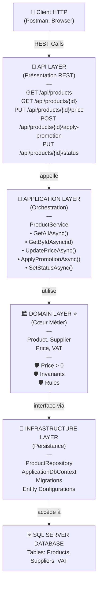
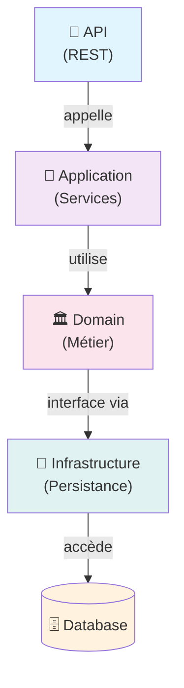
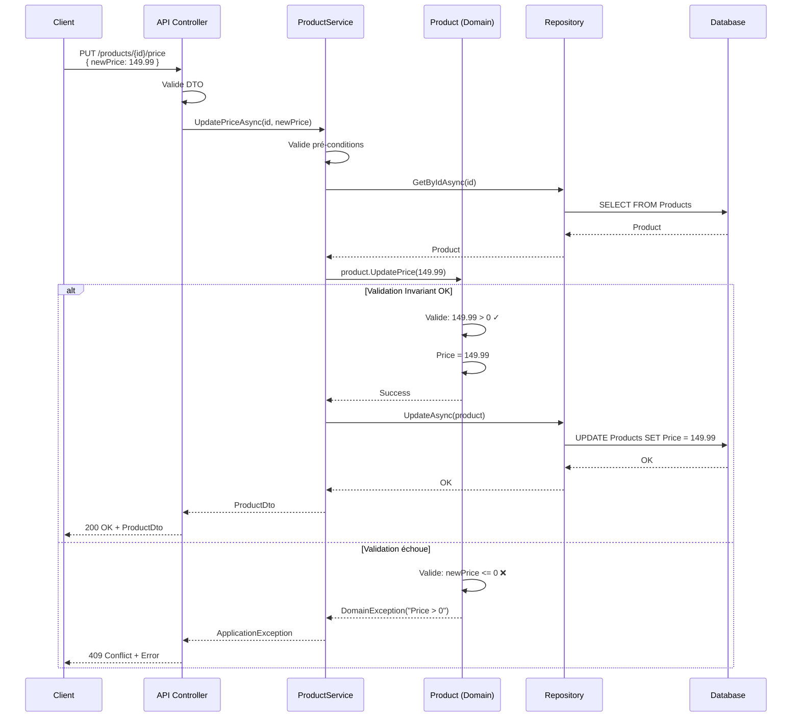
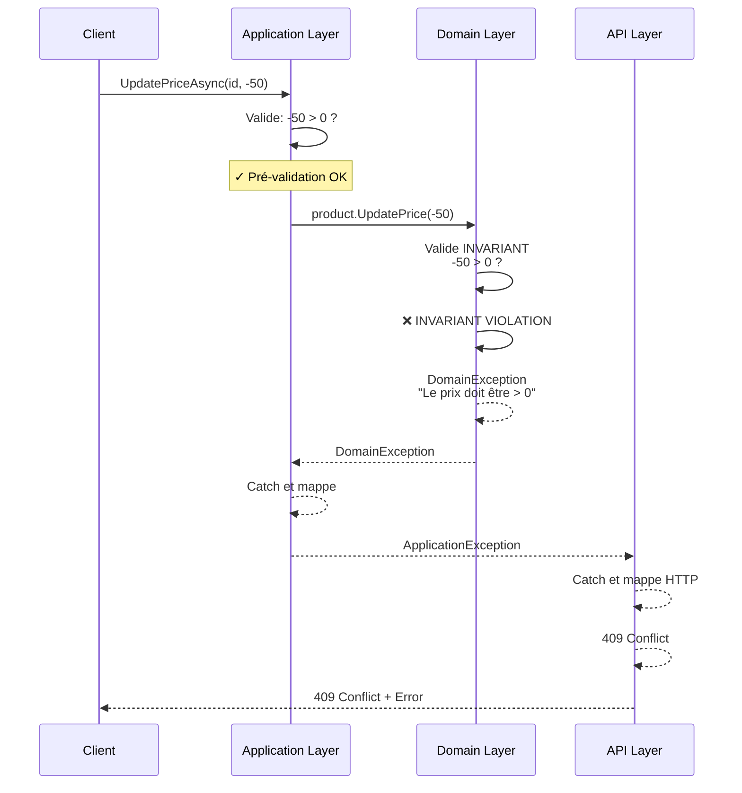

# 🎯 Architecture en un coup d'œil

## Schéma global



---

## Dépendances entre couches



**Règle d'or :** Chaque couche ne dépend que de la couche en dessous. JAMAIS l'inverse.

---

## Cas d'usage : "Modifier le prix d'un produit"



---

## Gestion d'erreur : "Prix invalide"

```
┌──────────────────────────────────────┐
│ Client envoie: newPrice = -50        │
└──────────────────────────────────────┘
         │
         ↓
┌──────────────────────────────────────┐
│ Application Layer valide (OK)        │
│ price > 0 ? ✓                        │
└──────────────────────────────────────┘
         │
         ↓
## Gestion d'erreur : "Prix invalide"



---

## Tableau comparatif des responsabilités

| Aspect | API | Application | Domain | Infrastructure |
|--------|-----|-------------|--------|----------------|
| **Endpoints HTTP** | ✅ | ❌ | ❌ | ❌ |
| **DTOs** | ✅ | ✅ | ❌ | ❌ |
| **Validation métier** | ❌ | ✅ | ✅ | ❌ |
| **Orchestration** | ❌ | ✅ | ❌ | ❌ |
| **Entités métier** | ❌ | ❌ | ✅ | ❌ |
| **Règles métier** | ❌ | ❌ | ✅ | ❌ |
| **Repositories** | ❌ | ❌ | ❌ | ✅ |
| **Base de données** | ❌ | ❌ | ❌ | ✅ |
| **EF Core** | ❌ | ❌ | ❌ | ✅ |

---

## Stack technologique

```
┌─────────────────────────┐
│ Framework : ASP.NET Core 6.0+
│ Langage : C# 10+
│ ORM : Entity Framework Core
│ Base de données : SQL Server (ou autre)
│ Architecture : Clean Architecture + DDD
└─────────────────────────┘
```

---

## Les 5 Use Cases

```
1️⃣  GET /api/products
    Lister tous les produits actifs
    
2️⃣  GET /api/products/{id}
    Afficher les détails d'un produit
    
3️⃣  PUT /api/products/{id}/price
    Modifier le prix (>0, INVARIANT protégé)
    
4️⃣  POST /api/products/{id}/apply-promotion
    Appliquer une réduction (0-100%, price > 0)
    
5️⃣  PUT /api/products/{id}/status
    Activer/Désactiver un produit
```

---

## Les 5 Règles Métier

```
🛡️  CRITIQUE: Price > 0
    └─ Le prix doit toujours être > 0
    └─ Protégé à chaque mutation
    └─ Immuable et valide

✅ HAUTE: Produit avec prix valide
    └─ Tout produit a un prix
    └─ Un produit sans prix ne peut pas exister
    
✅ HAUTE: Invariant de prix
    └─ Price reste valide après chaque opération
    └─ Mutation atomique (tout ou rien)
    
✅ MOYENNE: État d'activation
    └─ Produit actif → visible publiquement
    └─ Produit inactif → caché, mais modifiable
    
✅ HAUTE: Promotion valide
    └─ Pourcentage entre 0 et 100%
    └─ Prix final respecte Règle 1
```

---

## Contrats entre les couches

### API ↔ Application (Interface: IProductService)
```csharp
Task<IEnumerable<ProductDto>> GetAllAsync();
Task<ProductDto> GetByIdAsync(Guid id);
Task<ProductDto> UpdatePriceAsync(Guid id, decimal newPrice);
Task<ProductDto> ApplyPromotionAsync(Guid id, decimal discount);
Task<ProductDto> SetStatusAsync(Guid id, bool isActive);
```

### Application ↔ Domain (Entités)
```csharp
Product.UpdatePrice(decimal newPrice)  // Lève DomainException si invalide
Product.ApplyDiscount(decimal %)       // Lève DomainException si invalide
Product.SetStatus(bool isActive)       // Simple
```

### Application ↔ Infrastructure (Interface: IProductRepository)
```csharp
Task<Product> GetByIdAsync(Guid id);
Task<IEnumerable<Product>> GetAllActiveAsync();
Task UpdateAsync(Product product);
```

---

## Checklist de compréhension

- [ ] Je comprends le flux de dépendances (haut → bas)
- [ ] Je sais où se trouvent les règles métier (Domain)
- [ ] Je sais où se trouvent les endpoints (API)
- [ ] Je sais comment les exceptions se propagent
- [ ] Je comprends le cas "Modifier le prix"
- [ ] Je sais ce qu'est un invariant (Price > 0)
- [ ] Je comprends le rôle de chaque couche
- [ ] Je sais utiliser les repositories
- [ ] Je comprends les DTOs et mappers
- [ ] Je sais localiser une fonctionnalité dans le code

---

## Ressources

- [INDEX.md](./INDEX.md) - Vue d'ensemble complète
- [01_API_Documentation.md](./01_API_Documentation.md) - Détails de l'API
- [02_Domain_Documentation.md](./02_Domain_Documentation.md) - Cœur métier
- [03_Application_Documentation.md](./03_Application_Documentation.md) - Orchestration
- [04_Infrastructure_Documentation.md](./04_Infrastructure_Documentation.md) - Persistance

---

**Architecture en un coup d'œil - AdvancedDevSample**

*Pour plus de détails, consulter les documentations respectives de chaque couche.*
