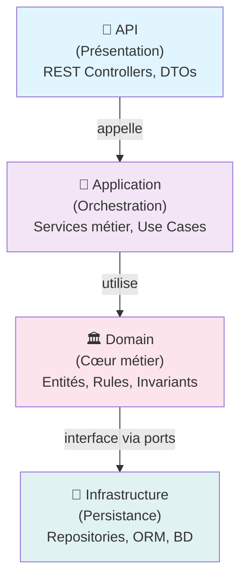

# Index de Documentation - AdvancedDevSample

**Version:** 1.0  
**Date:** 28 janvier 2026  
**État:** En cours de développement

> ⚠️ **Note** : Ceci est un exercice pédagogique, pas destiné à une utilisation en production.

---

## 📚 Structure de la documentation

La documentation du projet **AdvancedDevSample** est organisée en plusieurs sections, une par couche architecturale :

### 1. 🎯 [Documentation API - AdvancedDevSample.API](./01_API_Documentation.md)
Couche de présentation REST. Définit les endpoints, les DTOs et la gestion des requêtes/réponses HTTP.

**Contenu :**
- Endpoints REST disponibles
- Modèles de requête/réponse (DTOs)
- Codes d'erreur HTTP
- Exemples d'appels API

**Liens internes :**
- → [Concepts métier (Domain)](./02_Domain_Documentation.md)
- → [Services applicatifs (Application)](./03_Application_Documentation.md)

---

### 2. 🏛️ [Documentation Domain - AdvancedDevSample.Domain](./02_Domain_Documentation.md)
Couche métier fondamentale. Contient les entités, valeurs métier et règles de gestion.

**Contenu :**
- Entités : Product, Supplier, VAT
- Value Objects : Price
- Règles métier et invariants
- Exceptions métier
- Interfaces (ports)

**Liens internes :**
- → [Implémentation dans Application](./03_Application_Documentation.md)
- → [Persistance (Infrastructure)](./04_Infrastructure_Documentation.md)

---

### 3. 🔧 [Documentation Application - AdvancedDevSample.Application](./03_Application_Documentation.md)
Couche orchestration et logique métier. Contient les services applicatifs et les DTOs.

**Contenu :**
- Services applicatifs (ProductService)
- Cas d'usage (Use Cases)
- Mappage Domain → DTOs
- Gestion des erreurs applicatives

**Liens internes :**
- → [Entités métier (Domain)](./02_Domain_Documentation.md)
- → [Accès aux données (Infrastructure)](./04_Infrastructure_Documentation.md)
- → [Exposition API (API)](./01_API_Documentation.md)

---

### 4. 💾 [Documentation Infrastructure - AdvancedDevSample.Infrastructure](./04_Infrastructure_Documentation.md)
Couche technique. Gère la persistance, les migrations et l'accès aux données.

**Contenu :**
- Repositories et patterns d'accès
- Configuration Entity Framework Core
- Migrations base de données
- DbContext

**Liens internes :**
- → [Interfaces du Domain](./02_Domain_Documentation.md)
- → [Services Application](./03_Application_Documentation.md)

---

## 🔄 Flux de dépendances

---

## 🚀 Guide de lecture recommandé

### Pour un **nouveau développeur** :
1. Lire l'[INDEX](./INDEX.md) (ce document)
2. Lire la [Documentation Domain](./02_Domain_Documentation.md) → comprendre les concepts
3. Lire la [Documentation Application](./03_Application_Documentation.md) → comprendre la logique
4. Lire la [Documentation Infrastructure](./04_Infrastructure_Documentation.md) → comprendre la persistance
5. Lire la [Documentation API](./01_API_Documentation.md) → comprendre l'interface

### Pour un **intégrateur API** :
1. Lire la [Documentation API](./01_API_Documentation.md) → endpoints et modèles
2. Consulter les exemples Postman dans l'annexe
3. Revenir au [Domain](./02_Domain_Documentation.md) si besoin de comprendre les règles métier

### Pour un **développeur Infrastructure** :
1. Lire la [Documentation Domain](./02_Domain_Documentation.md) → les interfaces
2. Lire la [Documentation Infrastructure](./04_Infrastructure_Documentation.md) → implémentation
3. Consulter [Application](./03_Application_Documentation.md) pour les cas d'usage

---

## 📋 Table de synthèse

| Aspect | Document | Section |
|--------|----------|---------|
| Endpoints REST | API | [Fonctionnement](./01_API_Documentation.md#fonctionnement) |
| Modèles de données | Domain | [Concepts métier](./02_Domain_Documentation.md#concepts-métier) |
| Règles métier | Domain | [Règles métier](./02_Domain_Documentation.md#règles-métier) |
| Services métier | Application | [Services](./03_Application_Documentation.md#services-applicatifs) |
| Accès aux données | Infrastructure | [Repositories](./04_Infrastructure_Documentation.md#repositories) |
| DTOs/Mappage | Application | [DTOs](./03_Application_Documentation.md#dtos) |
| Configuration | Infrastructure | [Configuration](./04_Infrastructure_Documentation.md#configuration) |

---

## 🔗 Glossaire des liens

- **[API]** → Documentation API (couche présentation REST)
- **[Domain]** → Documentation Domain (couche cœur métier)
- **[Application]** → Documentation Application (couche orchestration)
- **[Infrastructure]** → Documentation Infrastructure (couche persistance)

Chaque document contient des liens vers les autres pour la navigation.

---

## 📞 Contactez-nous

- **Architecte** : À définir
- **Lead Dev** : À définir

---

**Dernière mise à jour :** 28/01/2026
