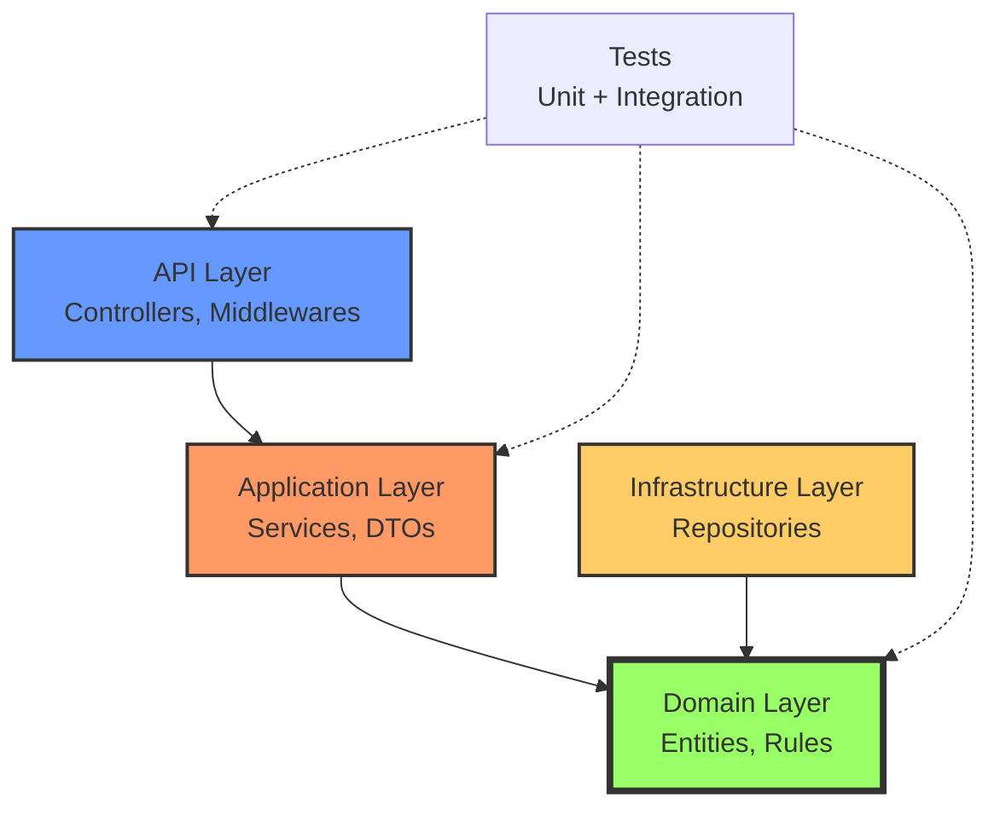

# AdvancedDevSample

[](https://dotnet.microsoft.com/)
[](LICENSE)
[](https://sonarcloud.io/summary/new_code?id=Gauthier-Damien_AdvancedDevSample)
[](https://sonarcloud.io/summary/new_code?id=Gauthier-Damien_AdvancedDevSample)

> **Application de gestion de catalogue produits avec Clean Architecture et DDD**

---

## 🎯 Vue d'ensemble

**AdvancedDevSample** est un projet pédagogique démontrant l'implémentation d'une **Clean Architecture** dans l'écosystème .NET 9.0, avec des principes **Domain-Driven Design (DDD)** et une authentification **JWT** complète.

### 🌟 Points Forts

- ✅ **Clean Architecture** - Séparation stricte des responsabilités
- ✅ **Domain-Driven Design** - Entités riches avec règles métier
- ✅ **JWT Authentication** - Authentification sécurisée avec refresh tokens
- ✅ **137 Tests** - Couverture >80% (unitaires + intégration)
- ✅ **SonarCloud** - Analyse de qualité automatisée
- ✅ **GitHub Actions** - CI/CD complet
- ✅ **Documentation exhaustive** - MkDocs + Swagger

### 📊 Métriques de Qualité

| Métrique | Valeur | Statut |
|----------|--------|--------|
| **Tests** | 137 | ✅ 100% réussis |
| **Coverage** | >80% | ✅ Excellent |
| **Quality Gate** | Passed | ✅ Validé |
| **Bugs** | 0 | ✅ Aucun |
| **Vulnerabilities** | 0 | ✅ Sécurisé |

---

## 🚀 Démarrage Rapide

```bash
# Cloner le repository
git clone https://github.com/Gauthier-Damien/AdvancedDevSample.git
cd AdvancedDevSample

# Restaurer et compiler
dotnet restore
dotnet build

# Lancer l'application
dotnet run --project AdvancedDevSample.API
```

**Swagger UI :** [https://localhost:5181/swagger](https://localhost:5181/swagger)

### Comptes de test

| Username | Password | Rôle |
|----------|----------|------|
| `demo` | `demo123` | Student |
| `admin` | `admin123` | Admin |

!!! tip "Test rapide avec Swagger"
    1. Ouvrir Swagger UI
    2. POST `/api/auth/login` avec `demo/demo123`
    3. Copier le token
    4. Cliquer sur 🔒 **Authorize**
    5. Tester les autres endpoints !

---

## 📚 Navigation Documentation

<div class="grid cards" markdown>

-   :material-rocket-launch:{ .lg .middle } __Démarrage Rapide__

    ---

    Installation, configuration et premier lancement

    [:octicons-arrow-right-24: Commencer](getting-started/quick-start.md)

-   :material-library:{ .lg .middle } __Architecture__

    ---

    Clean Architecture, DDD et structure du projet

    [:octicons-arrow-right-24: Explorer](architecture/overview.md)

-   :material-api:{ .lg .middle } __API Documentation__

    ---

    Tous les endpoints avec exemples

    [:octicons-arrow-right-24: Consulter](api/authentication.md)

-   :material-check-circle:{ .lg .middle } __Qualité & CI/CD__

    ---

    SonarCloud, GitHub Actions et tests

    [:octicons-arrow-right-24: Analyser](quality/sonarcloud.md)

</div>

---

## 🏗️ Architecture



---

## 🛠️ Technologies

- **Framework:** ASP.NET Core 9.0
- **Authentification:** JWT Bearer
- **Tests:** xUnit + Moq
- **Qualité:** SonarCloud
- **CI/CD:** GitHub Actions
- **Documentation:** MkDocs Material

---

## 📖 Ressources

- :fontawesome-brands-github: [Repository GitHub](https://github.com/Gauthier-Damien/AdvancedDevSample)
- :material-chart-line: [Dashboard SonarCloud](https://sonarcloud.io/project/overview?id=Gauthier-Damien_AdvancedDevSample)
- :material-play-circle: [GitHub Actions](https://github.com/Gauthier-Damien/AdvancedDevSample/actions)

---

!!! success "Projet Validé"
    ✅ Quality Gate: **Passed**  
    ✅ Tests: **137/137 réussis**  
    ✅ Coverage: **>80%**  
    ✅ Documentation: **Complète**

---

*Dernière mise à jour : 10 février 2026*
