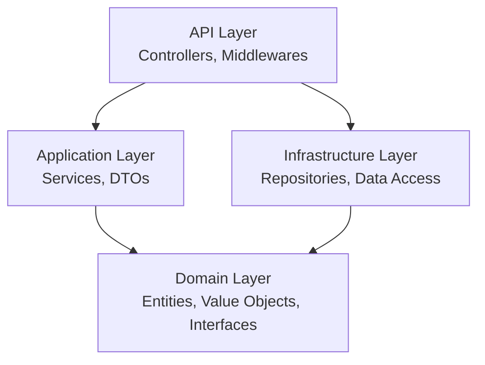

# AdvancedDevSample - Documentation Technique

Bienvenue dans la documentation technique du projet **AdvancedDevSample**.

## Vue d'ensemble

AdvancedDevSample est une application de gestion de catalogue produits développée selon les principes de **Clean Architecture** et du **Domain-Driven Design (DDD)**.

### Fonctionnalités principales

- 📦 **Gestion des Produits** : CRUD complet avec validation métier
- 🏢 **Gestion des Fournisseurs** : Association produits-fournisseurs
- 👥 **Gestion des Utilisateurs** : Base utilisateurs
- 📋 **Gestion des Commandes** : Système de commandes avec lignes de détail
- 🔒 **Validation métier** : Règles métier strictes (prix positifs, invariants)
- 🛡️ **Protection DDoS** : Rate limiting intégré
- 📊 **API REST** : Interface complète testable via Swagger

## Architecture

Le projet suit une architecture en couches avec séparation stricte des responsabilités :



### Couches

- **[API](architecture/api.md)** : Point d'entrée, Controllers, Middlewares
- **[Application](architecture/application.md)** : Services métier, DTOs, orchestration
- **[Domain](architecture/domain.md)** : Logique métier, entités, règles
- **[Infrastructure](architecture/infrastructure.md)** : Accès données, repositories

## Technologies

- **.NET 9.0** : Framework principal
- **ASP.NET Core** : API REST
- **Swagger/OpenAPI** : Documentation API
- **xUnit** : Tests unitaires et d'intégration
- **MkDocs Material** : Documentation

## Démarrage rapide

### Prérequis

- .NET 9.0 SDK
- IDE (Rider, Visual Studio, VS Code)

### Installation

```bash
# Cloner le repository
git clone https://github.com/yourusername/AdvancedDevSample.git

# Restaurer les dépendances
dotnet restore

# Compiler la solution
dotnet build

# Lancer l'API
cd AdvancedDevSample.API
dotnet run
```

### Accès Swagger

Une fois l'API lancée, accédez à Swagger UI :

```
https://localhost:5181/swagger
```

## Règles métier

### Produits

- ✅ Le prix doit être strictement positif
- ✅ Un produit doit toujours avoir un prix valide
- ✅ La TVA doit être valide (entre 0 et 100%)

### Commandes

- ✅ Une commande doit contenir au moins une ligne
- ✅ Les quantités doivent être positives

## Structure du projet

```
AdvancedDevSample/
├── AdvancedDevSample.API/          # Couche présentation (Controllers, Middlewares)
├── AdvancedDevSample.Application/  # Couche application (Services, DTOs)
├── AdvancedDevSample.Domain/       # Couche domaine (Entités, Interfaces)
├── AdvancedDevSample.Infrastructure/ # Couche infrastructure (Repositories)
├── AdvancedDevSample.Test/         # Tests unitaires et d'intégration
└── Docs/                           # Documentation MkDocs
```

## Navigation

- 🏗️ [Architecture détaillée](architecture/overview.md)
- 🔌 [Documentation API](api/introduction.md)
- 🧪 [Guide des tests](tests/unit-tests.md)
- 💻 [Guide développeur](development/installation.md)

## Contact

Pour toute question ou contribution, n'hésitez pas à ouvrir une issue sur GitHub.

---

*Dernière mise à jour : Février 2026*
