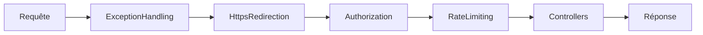
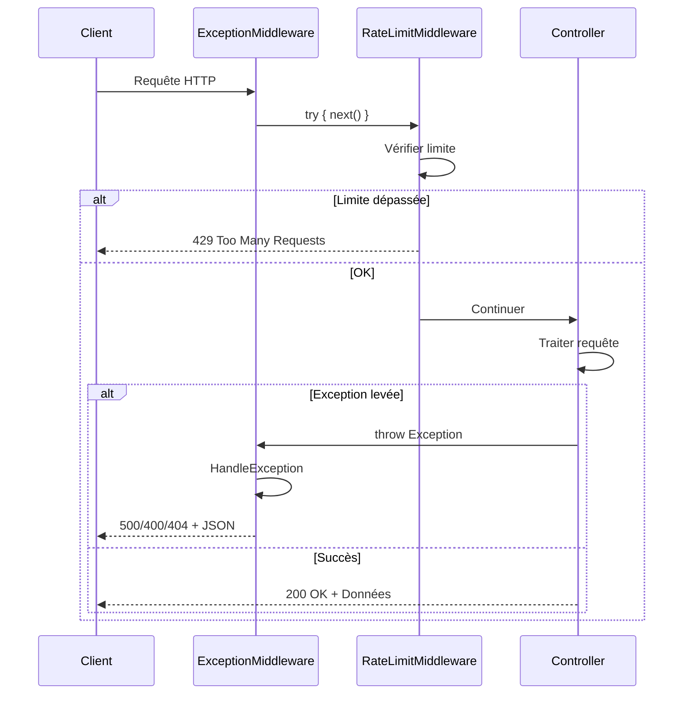

# API - Middlewares

## Vue d'ensemble

Les **middlewares** sont des composants du pipeline HTTP qui traitent les requêtes et réponses de manière transversale.

## Pipeline HTTP



## Middlewares disponibles

### ExceptionHandlingMiddleware

**Responsabilité** : Gestion centralisée de toutes les exceptions.

```csharp
public class ExceptionHandlingMiddleware
{
    private readonly RequestDelegate _next;
    private readonly ILogger<ExceptionHandlingMiddleware> _logger;
    
    public async Task InvokeAsync(HttpContext context)
    {
        try
        {
            await _next(context);
        }
        catch (Exception ex)
        {
            _logger.LogError(ex, "Une erreur s'est produite");
            await HandleExceptionAsync(context, ex);
        }
    }
    
    private static Task HandleExceptionAsync(HttpContext context, Exception exception)
    {
        context.Response.ContentType = "application/json";
        
        var statusCode = exception switch
        {
            NotFoundException => StatusCodes.Status404NotFound,
            ValidationException => StatusCodes.Status400BadRequest,
            _ => StatusCodes.Status500InternalServerError
        };
        
        context.Response.StatusCode = statusCode;
        
        var response = new
        {
            message = exception.Message,
            details = context.RequestServices
                .GetService<IWebHostEnvironment>()?.IsDevelopment() == true
                ? exception.StackTrace
                : null
        };
        
        return context.Response.WriteAsJsonAsync(response);
    }
}
```

**Avantages** :
- ✅ Gestion centralisée des erreurs
- ✅ Code des controllers simplifié
- ✅ Réponses d'erreur cohérentes
- ✅ Logging automatique
- ✅ Détails techniques masqués en production

**Enregistrement** :

```csharp
// Dans Program.cs
app.UseMiddleware<ExceptionHandlingMiddleware>();
```

### Rate Limiting

**Responsabilité** : Protection contre les abus et attaques DDoS.

**Configuration** :
- **Limite** : 100 requêtes par minute par IP
- **Action** : Retourne `429 Too Many Requests` si dépassement

```csharp
public class RateLimitingMiddleware
{
    private static readonly ConcurrentDictionary<string, (DateTime, int)> _requests = new();
    private const int MaxRequests = 100;
    private static readonly TimeSpan TimeWindow = TimeSpan.FromMinutes(1);
    
    public async Task InvokeAsync(HttpContext context)
    {
        var ipAddress = context.Connection.RemoteIpAddress?.ToString() ?? "unknown";
        
        if (!IsRequestAllowed(ipAddress))
        {
            context.Response.StatusCode = StatusCodes.Status429TooManyRequests;
            await context.Response.WriteAsync("Trop de requêtes. Veuillez réessayer plus tard.");
            return;
        }
        
        await _next(context);
    }
    
    private bool IsRequestAllowed(string ipAddress)
    {
        var now = DateTime.UtcNow;
        
        _requests.AddOrUpdate(
            ipAddress,
            (now, 1),
            (key, value) =>
            {
                var (time, count) = value;
                if (now - time > TimeWindow)
                    return (now, 1);
                return (time, count + 1);
            }
        );
        
        var (_, requestCount) = _requests[ipAddress];
        return requestCount <= MaxRequests;
    }
}
```

**Enregistrement** :

```csharp
// Dans Program.cs
app.UseMiddleware<RateLimitingMiddleware>();
```

## Ordre d'exécution

L'ordre des middlewares est **crucial** :

```csharp
var app = builder.Build();

// 1. Exception handling en premier pour capturer toutes les erreurs
app.UseMiddleware<ExceptionHandlingMiddleware>();

// 2. HTTPS redirection
if (app.Environment.IsDevelopment())
{
    app.UseSwagger();
    app.UseSwaggerUI();
}

// 3. Redirection HTTPS
app.UseHttpsRedirection();

// 4. Rate limiting
app.UseMiddleware<RateLimitingMiddleware>();

// 5. Authorization
app.UseAuthorization();

// 6. Controllers (fin du pipeline)
app.MapControllers();

app.Run();
```

## Flow de requête



## Gestion des exceptions par type

### NotFoundException

```csharp
// Levée par les services
throw new ProductNotFoundException(productId);

// Transformée par le middleware
// → 404 Not Found
{
  "message": "Produit avec l'ID '...' introuvable"
}
```

### ValidationException

```csharp
// Levée par les services ou le domain
throw new ValidationException("Le prix doit être strictement positif");

// Transformée par le middleware
// → 400 Bad Request
{
  "message": "Le prix doit être strictement positif"
}
```

### Exception générique

```csharp
// Exception non gérée
throw new InvalidOperationException("Erreur inattendue");

// Transformée par le middleware
// → 500 Internal Server Error
{
  "message": "Une erreur interne est survenue",
  "details": null  // En production
}
```

## Logging

Le middleware log toutes les exceptions :

```csharp
_logger.LogError(ex, "Une erreur s'est produite lors du traitement de la requête");
```

**Niveaux de log** :
- `LogError` : Exceptions inattendues (500)
- `LogWarning` : Erreurs métier (404, 400)
- `LogInformation` : Rate limiting dépassé (429)

## Environnement Development vs Production

### Development

```json
{
  "message": "Produit introuvable",
  "details": "   at ProductService.GetByIdAsync(...)\n   at ProductController.GetById(...)"
}
```

### Production

```json
{
  "message": "Produit introuvable",
  "details": null
}
```

**Sécurité** : Les stack traces ne sont **jamais** exposées en production.

## Avantages des middlewares

| Avantage | Description |
|----------|-------------|
| 🎯 **Séparation des responsabilités** | Logique transversale isolée |
| 🔄 **Réutilisabilité** | Un middleware pour toute l'application |
| 🧪 **Testabilité** | Middlewares testables indépendamment |
| 🛡️ **Sécurité** | Gestion cohérente des erreurs et limitations |

## Best practices

### ✅ À faire

- Placer `ExceptionHandlingMiddleware` en **premier**
- Logger toutes les exceptions
- Masquer les détails techniques en production
- Utiliser des exceptions typées

### ❌ À éviter

- `try-catch` dans chaque controller
- Exposer les stack traces en production
- Middlewares avec logique métier
- Ignorer les exceptions

## Navigation

- [Retour à l'API →](introduction.md)
- [Controllers →](controllers.md)
- [Endpoints →](endpoints.md)
