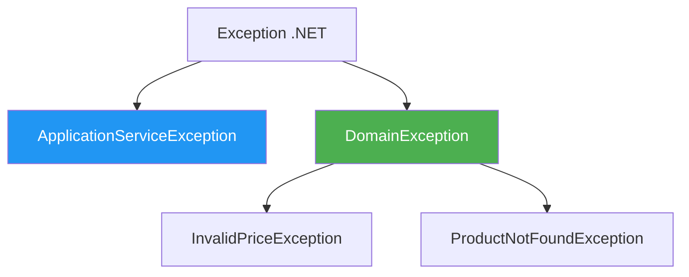
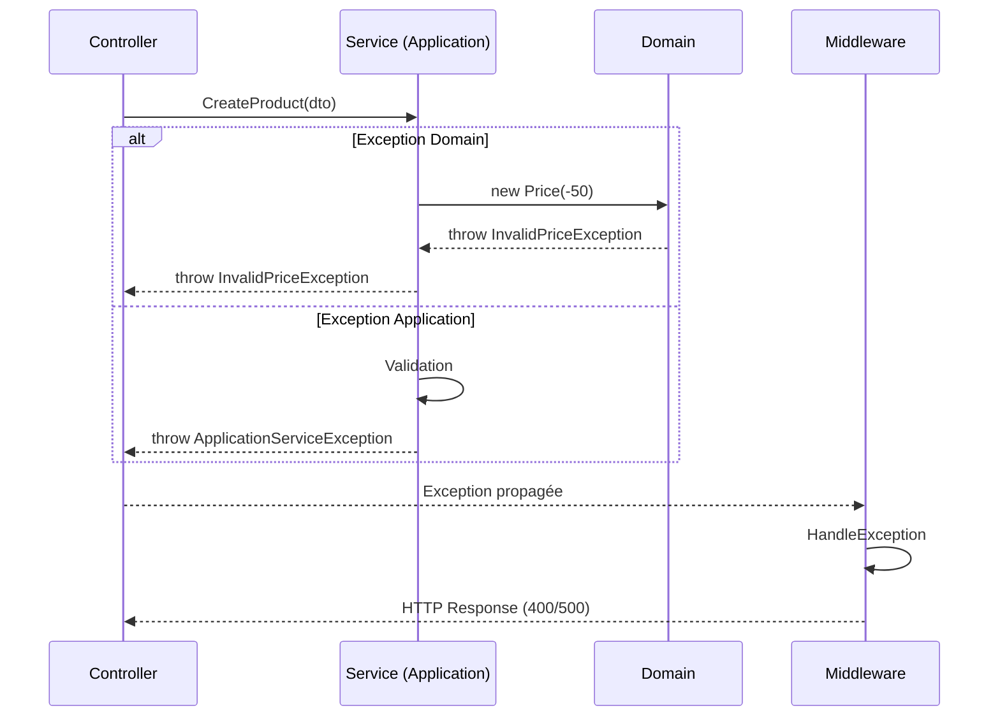

# Application - Exceptions

## Vue d'ensemble

Les **exceptions applicatives** sont levées par les services lorsqu'une erreur se produit au niveau de la couche Application.

## ApplicationServiceException

Exception de base pour la couche Application.

```csharp
/// <summary>
/// Exception levée par les services applicatifs
/// </summary>
public class ApplicationServiceException : Exception
{
    public ApplicationServiceException(string message) 
        : base(message)
    {
    }
    
    public ApplicationServiceException(string message, Exception innerException) 
        : base(message, innerException)
    {
    }
}
```

## Utilisation

### Wrapper d'exceptions inattendues

```csharp
public async Task<ProductDto> GetByIdAsync(Guid id)
{
    try
    {
        var product = await _repository.GetByIdAsync(id);
        if (product == null)
            throw new ProductNotFoundException(id);  // Exception Domain
        
        return MapToDto(product);
    }
    catch (DomainException)
    {
        // Propager les exceptions métier
        throw;
    }
    catch (Exception ex)
    {
        // Wrapper les autres exceptions
        throw new ApplicationServiceException(
            $"Erreur lors de la récupération du produit {id}", 
            ex
        );
    }
}
```

### Validation au niveau application

```csharp
public async Task<OrderDto> CreateAsync(CreateOrderDto dto)
{
    // Validation métier de haut niveau
    if (!dto.OrderLines.Any())
    {
        throw new ApplicationServiceException(
            "Une commande doit contenir au moins une ligne"
        );
    }
    
    // Vérification de l'existence de l'utilisateur
    var user = await _userRepository.GetByIdAsync(dto.UserId);
    if (user == null)
    {
        throw new ApplicationServiceException(
            $"L'utilisateur {dto.UserId} n'existe pas"
        );
    }
    
    // ...
}
```

## Hiérarchie des exceptions



## Flow des exceptions



## Gestion par le middleware

Le `ExceptionHandlingMiddleware` gère toutes les exceptions :

```csharp
private static Task HandleExceptionAsync(HttpContext context, Exception exception)
{
    var statusCode = exception switch
    {
        // Exceptions Domain
        ProductNotFoundException => StatusCodes.Status404NotFound,
        InvalidPriceException => StatusCodes.Status400BadRequest,
        DomainException => StatusCodes.Status400BadRequest,
        
        // Exceptions Application
        ApplicationServiceException => StatusCodes.Status500InternalServerError,
        
        // Autres
        _ => StatusCodes.Status500InternalServerError
    };
    
    context.Response.StatusCode = statusCode;
    
    return context.Response.WriteAsJsonAsync(new
    {
        message = exception.Message,
        details = IsDevelopment ? exception.StackTrace : null
    });
}
```

## Types d'exceptions par couche

| Couche | Exception | Exemple |
|--------|-----------|---------|
| **Domain** | DomainException | InvalidPriceException |
| **Application** | ApplicationServiceException | "Commande vide" |
| **Infrastructure** | RepositoryException | Erreur base de données |
| **API** | - | Pas d'exception custom (middleware) |

## Best Practices

### ✅ À faire

- **Propager** les exceptions Domain sans les wrapper
- **Logger** les exceptions avant de les relancer
- **Wrapper** uniquement les exceptions inattendues
- **Fournir un contexte** dans le message d'erreur

```csharp
catch (Exception ex)
{
    _logger.LogError(ex, "Erreur lors de la création du produit");
    throw new ApplicationServiceException(
        "Impossible de créer le produit", 
        ex
    );
}
```

### ❌ À éviter

- Capturer et ignorer les exceptions
- Wrapper les exceptions métier (Domain)
- Messages d'erreur génériques
- Logique métier dans les catch

## Logging

Les services doivent logger les erreurs :

```csharp
public class ProductService
{
    private readonly ILogger<ProductService> _logger;
    private readonly IProductRepository _repository;
    
    public async Task<ProductDto> CreateAsync(CreateProductDto dto)
    {
        try
        {
            _logger.LogInformation("Création d'un nouveau produit: {Name}", dto.Name);
            
            var product = new Product(/* ... */);
            await _repository.AddAsync(product);
            
            _logger.LogInformation("Produit créé avec succès: {Id}", product.Id);
            return MapToDto(product);
        }
        catch (Exception ex)
        {
            _logger.LogError(ex, "Erreur lors de la création du produit {Name}", dto.Name);
            throw;
        }
    }
}
```

## Exemples d'utilisation

### Validation de règles métier complexes

```csharp
public async Task<OrderDto> CreateAsync(CreateOrderDto dto)
{
    // Règle: Une commande doit avoir au moins une ligne
    if (!dto.OrderLines.Any())
        throw new ApplicationServiceException("Une commande doit contenir au moins une ligne");
    
    // Règle: L'utilisateur doit exister
    var user = await _userRepository.GetByIdAsync(dto.UserId);
    if (user == null)
        throw new ApplicationServiceException($"L'utilisateur {dto.UserId} n'existe pas");
    
    // Règle: Tous les produits doivent exister
    foreach (var line in dto.OrderLines)
    {
        var product = await _productRepository.GetByIdAsync(line.ProductId);
        if (product == null)
            throw new ApplicationServiceException($"Le produit {line.ProductId} n'existe pas");
    }
    
    // Création de la commande
    // ...
}
```

### Wrapper d'exceptions infrastructure

```csharp
public async Task<ProductDto> UpdateAsync(Guid id, UpdateProductDto dto)
{
    try
    {
        var product = await _repository.GetByIdAsync(id);
        if (product == null)
            throw new ProductNotFoundException(id);
        
        // Mise à jour
        await _repository.UpdateAsync(product);
        
        return MapToDto(product);
    }
    catch (DomainException)
    {
        // Propager les exceptions métier
        throw;
    }
    catch (DbUpdateException ex)
    {
        // Wrapper les exceptions EF Core
        throw new ApplicationServiceException("Erreur lors de la mise à jour en base de données", ex);
    }
}
```

## Navigation

- [Retour à Application →](../architecture/application.md)
- [Services →](services.md)
- [Exceptions Domain →](../domain/exceptions.md)
- [Middleware Exception Handling →](../api/middlewares.md)
