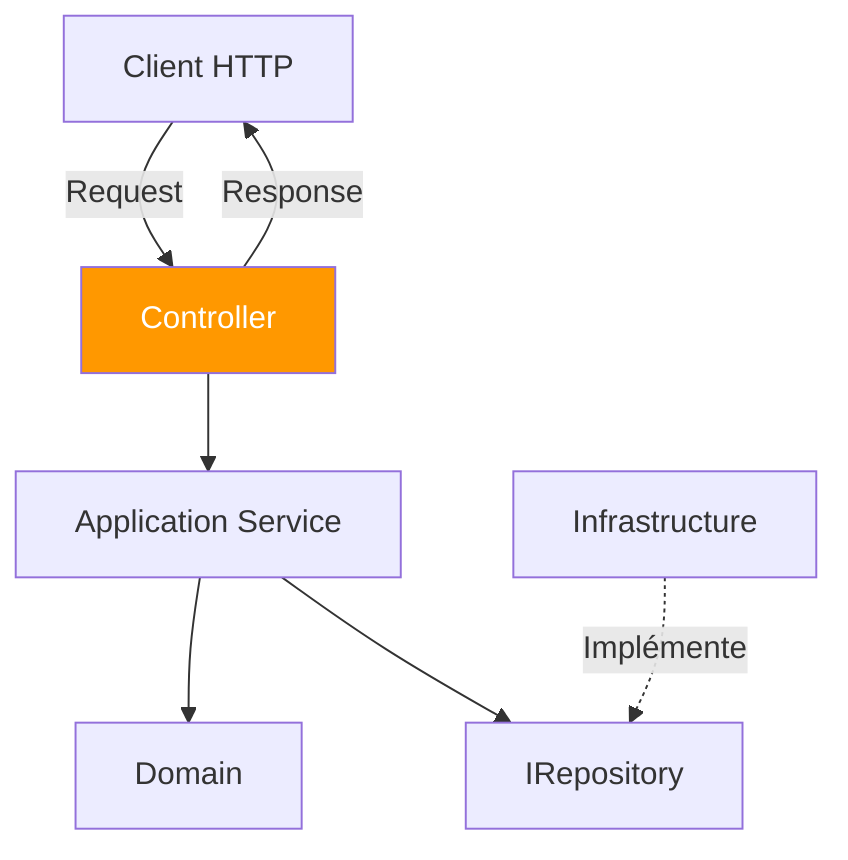
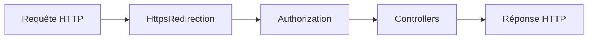
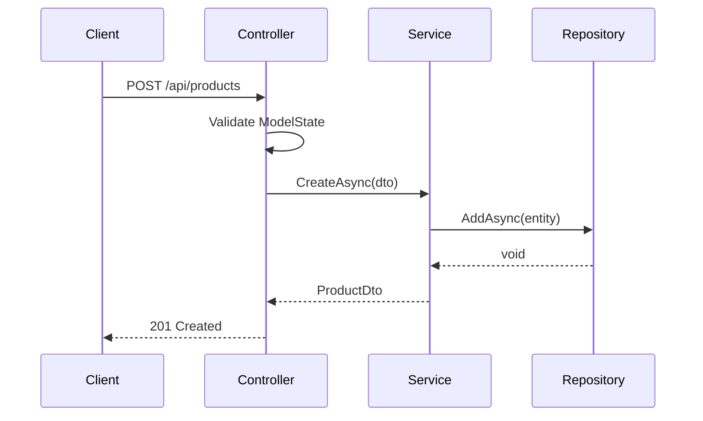
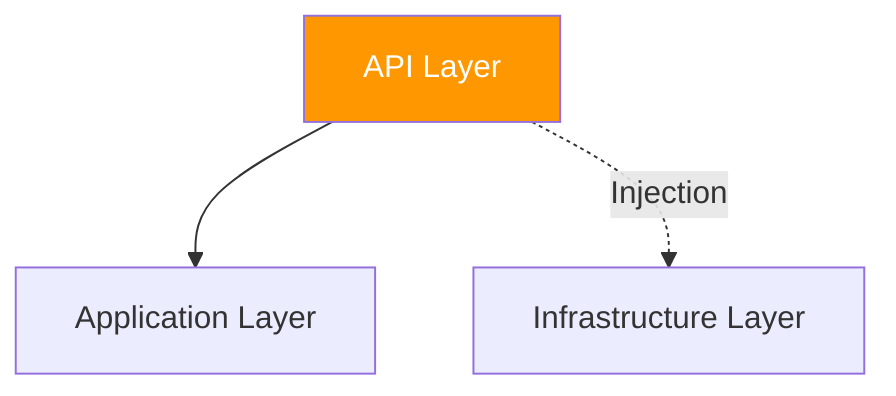

# API Layer - Couche Présentation

## Vue d'ensemble

La **couche API** est le point d'entrée de l'application. Elle expose les fonctionnalités via des **endpoints HTTP REST**.

## Responsabilités

- ✅ Exposer des **endpoints REST** (GET, POST, PUT, DELETE)
- ✅ Recevoir et valider les **requêtes HTTP**
- ✅ Appeler les **services Application**
- ✅ Transformer les résultats en **réponses HTTP**
- ✅ Gérer les **middlewares** (erreurs, logging, rate limiting)

## Structure

```
API/
├── Controllers/        # Controllers REST
│   ├── ProductController.cs
│   ├── SupplierController.cs
│   ├── UserController.cs
│   └── OrderController.cs
├── Middlewares/       # Middlewares personnalisés
│   └── ExceptionHandlingMiddleware.cs
├── Program.cs         # Configuration de l'application
└── appsettings.json   # Configuration
```

## Diagramme des dépendances



## Controllers

### Rôle

Les controllers :
1. Reçoivent les requêtes HTTP
2. Valident les données (ModelState)
3. Appellent les services
4. Retournent des réponses HTTP

```csharp
[ApiController]
[Route("api/[controller]")]
public class ProductController : ControllerBase
{
    private readonly ProductService _service;
    
    [HttpGet]
    public async Task<ActionResult<IEnumerable<ProductDto>>> GetAll()
    {
        var products = await _service.GetAllAsync();
        return Ok(products);
    }
    
    [HttpPost]
    public async Task<ActionResult<ProductDto>> Create(CreateProductDto dto)
    {
        var product = await _service.CreateAsync(dto);
        return CreatedAtAction(nameof(GetById), new { id = product.Id }, product);
    }
}
```

[En savoir plus →](../api/controllers.md)

## Middlewares

### ExceptionHandlingMiddleware

Capture toutes les exceptions et retourne des réponses HTTP appropriées :

```csharp
public class ExceptionHandlingMiddleware
{
    public async Task InvokeAsync(HttpContext context)
    {
        try
        {
            await _next(context);
        }
        catch (Exception ex)
        {
            await HandleExceptionAsync(context, ex);
        }
    }
}
```

**Avantages** :
- ✅ Gestion centralisée des erreurs
- ✅ Pas de `try-catch` dans chaque controller
- ✅ Réponses d'erreur cohérentes

[En savoir plus →](../api/middlewares.md)

## Pipeline HTTP



Configuration dans `Program.cs` :

```csharp
app.UseHttpsRedirection();
app.UseAuthorization();
app.MapControllers();
```

## Swagger / OpenAPI

Documentation automatique de l'API :

```csharp
builder.Services.AddSwaggerGen(options =>
{
    // Inclusion des commentaires XML
    var xmlFiles = Directory.GetFiles(AppContext.BaseDirectory, "*.xml");
    foreach (var xmlFile in xmlFiles)
    {
        options.IncludeXmlComments(xmlFile);
    }
});
```

**Accès** : `https://localhost:5181/swagger`

## Validation

### Validation automatique (ModelState)

```csharp
[HttpPost]
public async Task<ActionResult<ProductDto>> Create(CreateProductDto dto)
{
    // ASP.NET Core valide automatiquement le ModelState
    if (!ModelState.IsValid)
        return BadRequest(ModelState);
    
    // ...
}
```

### Attributs de validation

```csharp
public record CreateProductDto(
    [Required] string Name,
    [Range(0.01, double.MaxValue)] decimal Price,
    [Range(0, 100)] decimal VatRate
);
```

## Codes de statut HTTP

| Méthode | Succès | Ressource créée | Pas trouvé | Erreur validation |
|---------|--------|-----------------|------------|-------------------|
| GET     | 200 OK | -               | 404        | -                 |
| POST    | 200 OK | 201 Created     | -          | 400               |
| PUT     | 200 OK | -               | 404        | 400               |
| DELETE  | 204    | -               | 404        | -                 |

## Injection de dépendances

Dans `Program.cs` :

```csharp
// Services applicatifs
builder.Services.AddScoped<ProductService>();
builder.Services.AddScoped<SupplierService>();
builder.Services.AddScoped<UserService>();
builder.Services.AddScoped<OrderService>();

// Repositories
builder.Services.AddScoped<IProductRepository, EfProductRepository>();
// ...
```

## Rate Limiting

Protection contre les abus et DDoS :

- **Limite** : 100 requêtes/minute par IP
- **Implémentation** : Middleware personnalisé

```csharp
app.UseRateLimiting();
```

## Sécurité

### HTTPS obligatoire

```csharp
app.UseHttpsRedirection();
```

### Validation des entrées

Toutes les entrées utilisateur sont validées.

### Pas de détails techniques en production

Les détails des exceptions ne sont exposés qu'en développement.

## Flux de requête



## Dépendances



## Avantages

| Avantage | Description |
|----------|-------------|
| 🌐 **REST** | Standard, interopérable |
| 📖 **Swagger** | Documentation automatique |
| 🛡️ **Validation** | Données contrôlées |
| 🔧 **Maintenable** | Controllers simples, logique dans services |

## Navigation

- [Retour à l'architecture →](overview.md)
- [Introduction API →](../api/introduction.md)
- [Endpoints →](../api/endpoints.md)
- [Controllers →](../api/controllers.md)
- [Middlewares →](../api/middlewares.md)
