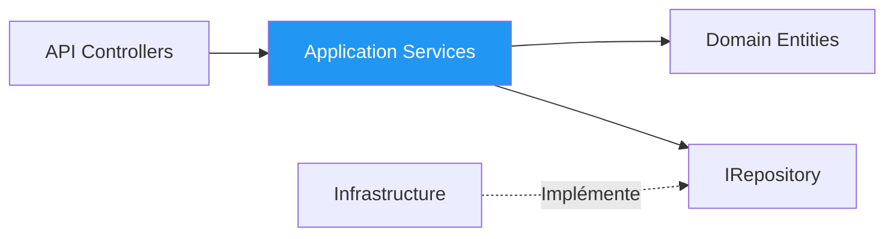
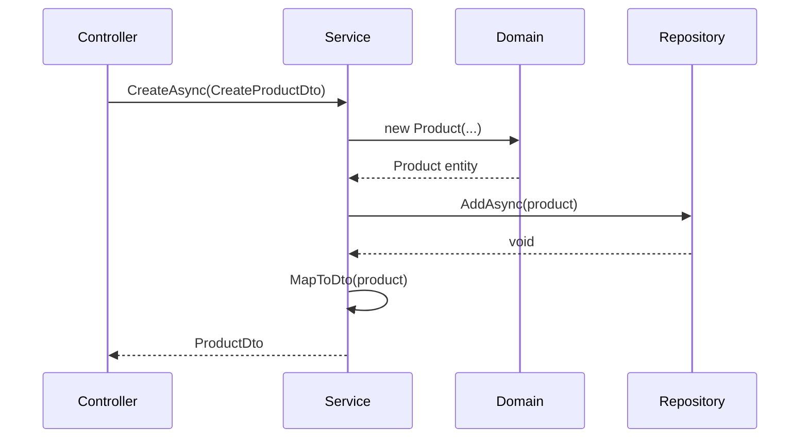
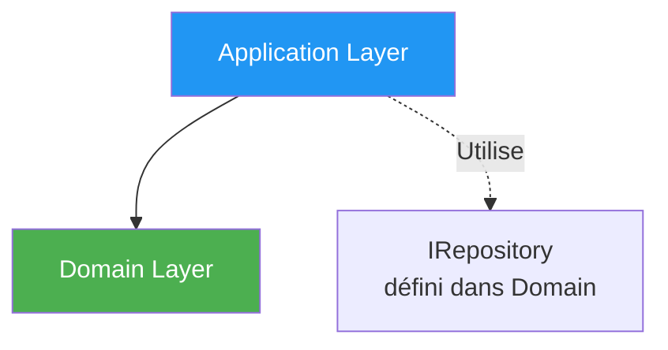

# Application Layer - Couche Application

## Vue d'ensemble

La **couche Application** orchestre la logique métier du Domain pour réaliser les cas d'usage de l'application.

## Responsabilités

- ✅ Orchestrer les **cas d'usage** (use cases)
- ✅ Coordonner les **entités du Domain**
- ✅ Transformer les données (Entity ↔ DTO)
- ✅ Gérer les **transactions**
- ✅ Valider les données d'entrée

## Structure

```
Application/
├── Services/           # Services applicatifs (ProductService, etc.)
├── DTOs/              # Data Transfer Objects
│   ├── Common/        # DTOs partagés
│   ├── Products/      # DTOs produits
│   ├── Orders/        # DTOs commandes
│   ├── Users/         # DTOs utilisateurs
│   └── Suppliers/     # DTOs fournisseurs
└── Exceptions/        # Exceptions applicatives
```

## Diagramme des dépendances



## Services applicatifs

### Rôle

Les services orchestrent la logique métier :

```csharp
public class ProductService
{
    private readonly IProductRepository _repository;
    
    public async Task<ProductDto> CreateAsync(CreateProductDto dto)
    {
        // 1. Créer l'entité Domain
        var product = new Product(
            dto.Name,
            new Price(dto.Price),
            new VAT(dto.VatRate)
        );
        
        // 2. Persister via le repository
        await _repository.AddAsync(product);
        
        // 3. Retourner un DTO
        return MapToDto(product);
    }
}
```

### Services disponibles

- **ProductService** : Gestion du catalogue produits
- **SupplierService** : Gestion des fournisseurs
- **UserService** : Gestion des utilisateurs
- **OrderService** : Gestion des commandes

[En savoir plus →](../application/services.md)

## Data Transfer Objects (DTOs)

### Rôle

Les DTOs transportent les données entre les couches :

- ✅ **Isolation** : Le Domain n'est pas exposé à l'extérieur
- ✅ **Simplicité** : Structures plates, faciles à sérialiser
- ✅ **Versioning** : Possibilité d'avoir plusieurs versions d'API

```csharp
// DTO pour créer un produit
public record CreateProductDto(
    string Name,
    string Description,
    decimal Price,
    decimal VatRate,
    Guid SupplierId
);

// DTO pour retourner un produit
public record ProductDto(
    Guid Id,
    string Name,
    string Description,
    decimal Price,
    decimal VatRate,
    bool IsActive,
    Guid SupplierId
);
```

[En savoir plus →](../application/dtos.md)

## Flux de données



## Gestion des exceptions

La couche Application capture les exceptions du Domain et les transforme :

```csharp
try
{
    var product = await _repository.GetByIdAsync(id);
    return MapToDto(product);
}
catch (ProductNotFoundException ex)
{
    throw new ApplicationServiceException("Produit introuvable", ex);
}
```

[En savoir plus →](../application/exceptions.md)

## Validation

### Validation des DTOs

La validation se fait à deux niveaux :

1. **Validation de forme** (dans les controllers via ModelState)
2. **Validation métier** (dans les services)

```csharp
public async Task<ProductDto> CreateAsync(CreateProductDto dto)
{
    // Validation métier
    if (dto.Price <= 0)
        throw new ValidationException("Le prix doit être strictement positif");
    
    // Logique métier
    // ...
}
```

## Dépendances



**Règle** : Application dépend **uniquement** de Domain.

## Avantages

| Avantage | Description |
|----------|-------------|
| 🎯 **Cas d'usage clairs** | Chaque service = un ensemble de cas d'usage |
| 🔄 **Transformation** | Entity ↔ DTO proprement géré |
| 🧪 **Testabilité** | Services mockables via interfaces |
| 📦 **Isolation** | Domain protégé de l'extérieur |

## Navigation

- [Retour à l'architecture →](overview.md)
- [Voir les services →](../application/services.md)
- [Voir les DTOs →](../application/dtos.md)
- [Voir les exceptions →](../application/exceptions.md)
