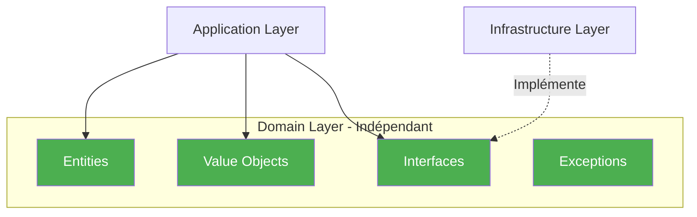

# Domain Layer - Couche Domaine

## Vue d'ensemble

La **couche Domain** est le cœur de l'application. Elle contient la logique métier pure, indépendante de toute infrastructure ou framework externe.

## Responsabilités

- ✅ Définir les **entités métier** (Product, Order, User, Supplier)
- ✅ Définir les **Value Objects** (Price, VAT, Email, etc.)
- ✅ Définir les **interfaces** (IRepository, etc.)
- ✅ Implémenter les **règles métier** et invariants
- ✅ Lever des **exceptions métier** spécifiques

## Principe fondamental

> **La couche Domain ne doit jamais dépendre des autres couches.**

Elle est **autonome** et **réutilisable** dans n'importe quel contexte.

## Structure

```
Domain/
├── Entities/           # Entités métier avec identité
├── ValueObjects/       # Objets valeur immuables
├── Interfaces/         # Contrats (IRepository, etc.)
└── Exceptions/         # Exceptions métier
```

## Diagramme des dépendances



## Contenu détaillé

### [Entités →](../domain/entities.md)
Objets avec identité unique (Product, Order, User, Supplier)

### [Value Objects →](../domain/value-objects.md)
Objets valeur immuables (Price, VAT, Email)

### [Interfaces →](../domain/interfaces.md)
Contrats pour les repositories et services

### [Exceptions →](../domain/exceptions.md)
Exceptions métier personnalisées

## Règles métier

### Invariants du domaine

Les règles métier sont **garanties** par le Domain :

```csharp
// Le prix doit toujours être strictement positif
public class Price
{
    public decimal Value { get; }
    
    public Price(decimal value)
    {
        if (value <= 0)
            throw new InvalidPriceException("Le prix doit être strictement positif");
        Value = value;
    }
}
```

### Validation dans les entités

```csharp
// Un produit doit toujours avoir un prix valide
public class Product
{
    public Price Price { get; private set; }
    
    public void UpdatePrice(Price newPrice)
    {
        Price = newPrice ?? throw new ArgumentNullException(nameof(newPrice));
        // Le constructeur de Price garantit la validité
    }
}
```

## Patterns utilisés

### Entity Pattern

Objets avec identité unique et cycle de vie.

### Value Object Pattern

Objets immuables définis par leurs valeurs.

### Repository Pattern

Abstraction de la persistance définie ici, implémentée ailleurs.

## Avantages

| Avantage | Description |
|----------|-------------|
| 🧪 **Testabilité** | Logique métier isolée, facile à tester |
| 🔒 **Indépendance** | Aucune dépendance externe |
| 📦 **Réutilisabilité** | Peut être utilisé dans différents contextes |
| 🛡️ **Robustesse** | Règles métier garanties |

## Navigation

- [Retour à l'architecture →](overview.md)
- [Voir les entités →](../domain/entities.md)
- [Voir les Value Objects →](../domain/value-objects.md)
