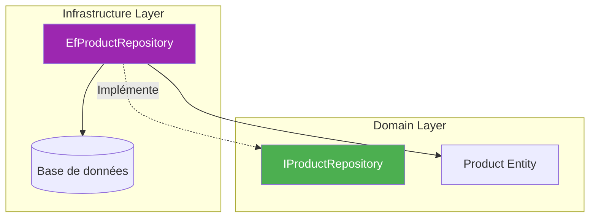
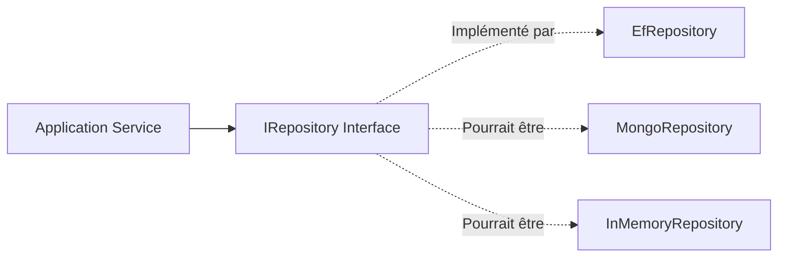
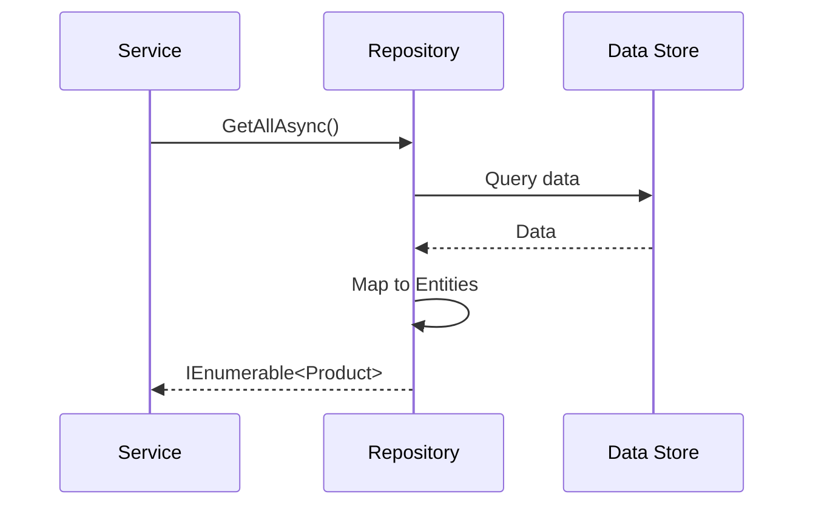
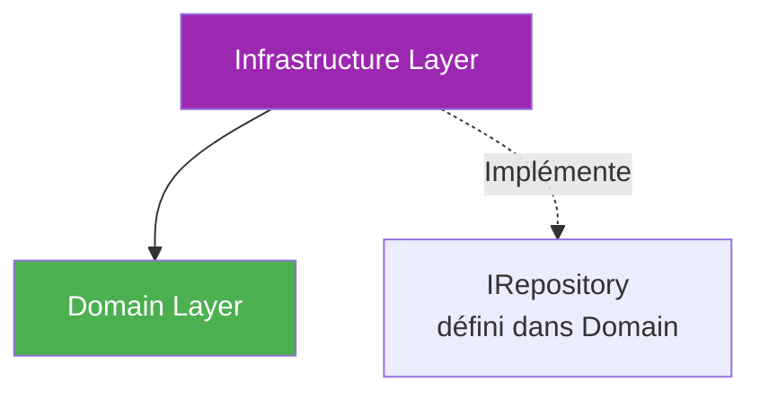

# Infrastructure Layer - Couche Infrastructure

## Vue d'ensemble

La **couche Infrastructure** contient les implémentations concrètes des interfaces définies dans le Domain, notamment pour l'accès aux données.

## Responsabilités

- ✅ Implémenter les **repositories** (IRepository)
- ✅ Gérer la **persistance** des données (Entity Framework Core)
- ✅ Configurer la **base de données**
- ✅ Gérer les **services externes** (API, messagerie, etc.)

## Structure

```
Infrastructure/
├── Repositories/       # Implémentations des repositories
│   ├── EfProductRepository.cs
│   ├── EfSupplierRepository.cs
│   ├── EfUserRepository.cs
│   └── EfOrderRepository.cs
├── Entities/          # Configurations EF Core (optionnel)
└── Exceptions/        # Exceptions infrastructure
```

## Diagramme des dépendances



## Pattern Repository

### Définition (Domain)

```csharp
// Défini dans Domain/Interfaces
public interface IProductRepository
{
    Task<IEnumerable<Product>> GetAllAsync();
    Task<Product?> GetByIdAsync(Guid id);
    Task AddAsync(Product product);
    Task UpdateAsync(Product product);
    Task DeleteAsync(Guid id);
}
```

### Implémentation (Infrastructure)

```csharp
// Implémenté dans Infrastructure/Repositories
public class EfProductRepository : IProductRepository
{
    private readonly List<Product> _products = new();
    
    public async Task<IEnumerable<Product>> GetAllAsync()
    {
        return await Task.FromResult(_products.AsEnumerable());
    }
    
    public async Task<Product?> GetByIdAsync(Guid id)
    {
        return await Task.FromResult(_products.FirstOrDefault(p => p.Id == id));
    }
    
    // ... autres méthodes
}
```

[En savoir plus →](../infrastructure/repositories.md)

## Repositories disponibles

| Repository | Interface | Description |
|------------|-----------|-------------|
| **EfProductRepository** | IProductRepository | Gestion des produits |
| **EfSupplierRepository** | ISupplierRepository | Gestion des fournisseurs |
| **EfUserRepository** | IUserRepository | Gestion des utilisateurs |
| **EfOrderRepository** | IOrderRepository | Gestion des commandes |

## Injection de dépendances

Dans `Program.cs` :

```csharp
// Enregistrement des repositories
builder.Services.AddScoped<IProductRepository, EfProductRepository>();
builder.Services.AddScoped<ISupplierRepository, EfSupplierRepository>();
builder.Services.AddScoped<IUserRepository, EfUserRepository>();
builder.Services.AddScoped<IOrderRepository, EfOrderRepository>();
```

## Avantages du pattern Repository

### 1. Abstraction de la persistance



Le code métier ne sait pas comment les données sont stockées.

### 2. Testabilité

```csharp
// Dans les tests, on peut mocker le repository
var mockRepo = new Mock<IProductRepository>();
mockRepo.Setup(r => r.GetAllAsync()).ReturnsAsync(testProducts);

var service = new ProductService(mockRepo.Object);
```

### 3. Changement de persistance facile

On peut remplacer EF Core par Dapper, MongoDB, etc. sans toucher au Domain ni à l'Application.

## État actuel (In-Memory)

⚠️ **Important** : Actuellement, les repositories utilisent des **collections en mémoire** (`List<T>`).

```csharp
// Données perdues au redémarrage
private readonly List<Product> _products = new();
```

### Migration vers une vraie base de données

Pour utiliser une vraie base de données (SQL Server, PostgreSQL, etc.) :

1. Installer Entity Framework Core
2. Créer un `DbContext`
3. Configurer les entités
4. Modifier les repositories pour utiliser le `DbContext`

[En savoir plus →](../infrastructure/configuration.md)

## Flux de données



## Gestion des exceptions

Les repositories peuvent lever des exceptions :

```csharp
public async Task<Product?> GetByIdAsync(Guid id)
{
    var product = _products.FirstOrDefault(p => p.Id == id);
    
    if (product == null)
        throw new ProductNotFoundException(id);
    
    return await Task.FromResult(product);
}
```

## Dépendances



**Règle** : Infrastructure dépend de Domain, mais Domain ne dépend **jamais** d'Infrastructure.

## Avantages

| Avantage | Description |
|----------|-------------|
| 🔌 **Pluggable** | Facile de changer de technologie de persistance |
| 🧪 **Testable** | Repositories mockables dans les tests |
| 🔒 **Isolation** | Logique métier isolée des détails techniques |
| 🔄 **Maintenable** | Changements de base de données localisés |

## Navigation

- [Retour à l'architecture →](overview.md)
- [Voir les repositories →](../infrastructure/repositories.md)
- [Configuration (future) →](../infrastructure/configuration.md)
