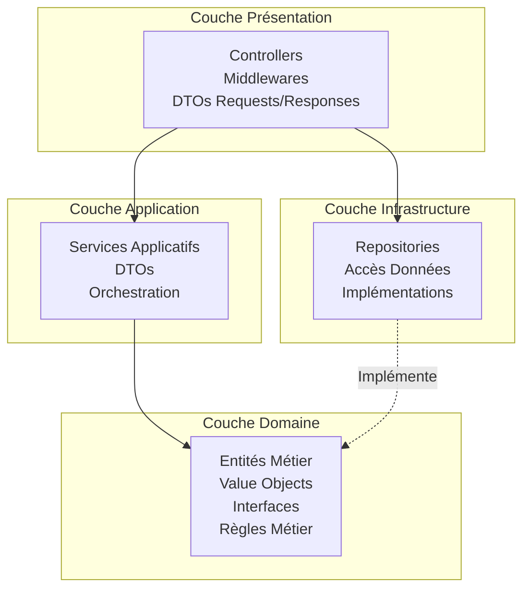
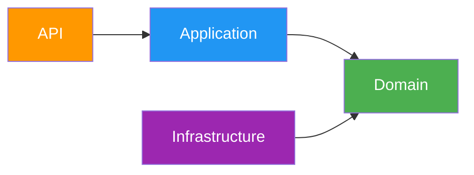
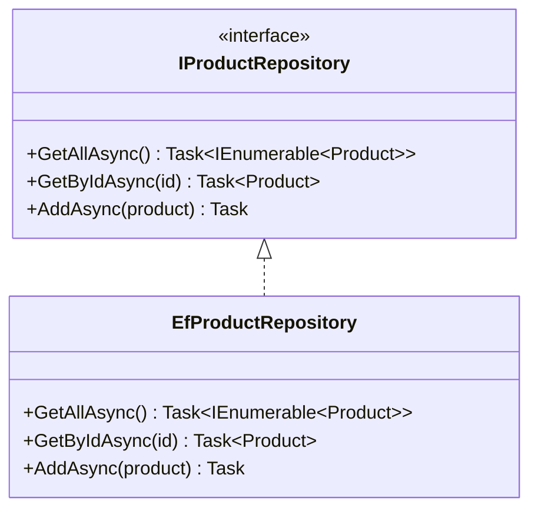
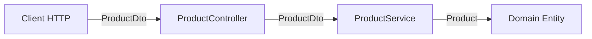

# Vue d'ensemble de l'Architecture

## Principes architecturaux

AdvancedDevSample est conçu selon les principes de **Clean Architecture** pour garantir :

- ✅ **Séparation des responsabilités** : Chaque couche a un rôle défini
- ✅ **Indépendance du framework** : Le domaine ne dépend pas de l'infrastructure
- ✅ **Testabilité** : Chaque couche peut être testée indépendamment
- ✅ **Maintenabilité** : Code organisé et évolutif

## Architecture en couches



## Flux de dépendances



**Règle d'or** : Les dépendances pointent toujours vers le **Domain** (centre de l'architecture).

## Description des couches

### 1. Domain (Cœur métier)

- **Responsabilité** : Contient la logique métier pure
- **Contenu** : Entités, Value Objects, Interfaces, Exceptions métier
- **Dépendances** : Aucune (indépendant)
- **Exemples** : `Product`, `Price`, `VAT`, `IProductRepository`

[En savoir plus →](domain.md)

### 2. Application (Services métier)

- **Responsabilité** : Orchestration de la logique métier
- **Contenu** : Services applicatifs, DTOs, Exceptions applicatives
- **Dépendances** : Domain uniquement
- **Exemples** : `ProductService`, `OrderService`, `ProductDto`

[En savoir plus →](application.md)

### 3. Infrastructure (Accès données)

- **Responsabilité** : Implémentation concrète des interfaces du domaine
- **Contenu** : Repositories, Configuration EF Core
- **Dépendances** : Domain
- **Exemples** : `EfProductRepository`, `EfOrderRepository`

[En savoir plus →](infrastructure.md)

### 4. API (Présentation)

- **Responsabilité** : Exposition des fonctionnalités via HTTP
- **Contenu** : Controllers, Middlewares, Configuration
- **Dépendances** : Application, Infrastructure (injection)
- **Exemples** : `ProductController`, `ExceptionHandlingMiddleware`

[En savoir plus →](api.md)

## Patterns utilisés

### Repository Pattern

Abstraction de l'accès aux données :



### Dependency Injection

Inversion de contrôle pour le découplage :

```csharp
// Configuration dans Program.cs
builder.Services.AddScoped<IProductRepository, EfProductRepository>();
builder.Services.AddScoped<ProductService>();
```

### DTO Pattern

Transfert de données entre couches :



## Avantages de cette architecture

| Avantage | Description |
|----------|-------------|
| 🧪 **Testabilité** | Chaque couche peut être testée en isolation |
| 🔧 **Maintenabilité** | Code organisé, facile à modifier |
| 📦 **Modularité** | Couplage faible entre les couches |
| 🔄 **Évolutivité** | Facile d'ajouter de nouvelles fonctionnalités |
| 🛡️ **Robustesse** | Validation métier centralisée |

## Règles de codage

1. **Le Domain ne doit jamais dépendre des autres couches**
2. **Les DTOs ne doivent pas être utilisés dans le Domain**
3. **Les entités du Domain ne doivent pas être exposées directement par l'API**
4. **L'Infrastructure implémente les interfaces définies dans le Domain**
5. **Les services Application orchestrent la logique métier**

## Navigation

- [Domain Layer →](domain.md)
- [Application Layer →](application.md)
- [Infrastructure Layer →](infrastructure.md)
- [API Layer →](api.md)
