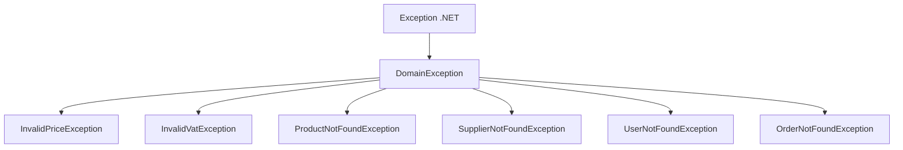
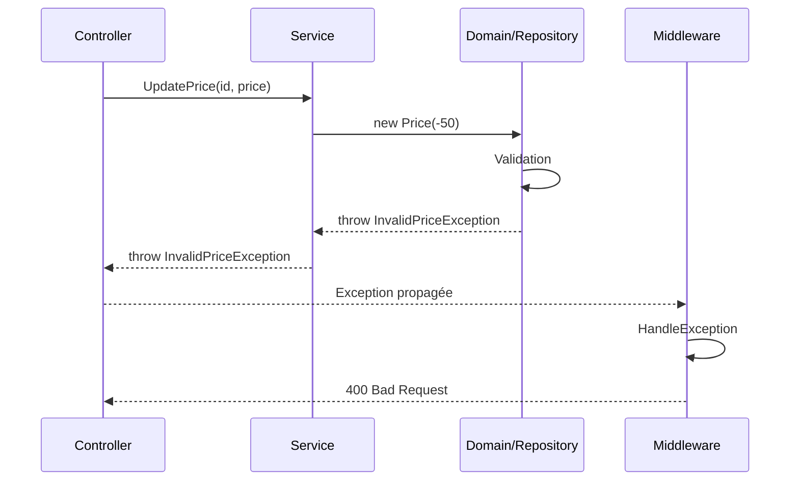

# Domain - Exceptions

## Vue d'ensemble

Les **exceptions métier** sont levées lorsque les règles du domain sont violées.

## Exceptions disponibles

### InvalidPriceException

Levée lorsqu'un prix invalide est fourni.

```csharp
public class InvalidPriceException : DomainException
{
    public InvalidPriceException(string message) 
        : base(message)
    {
    }
    
    public InvalidPriceException(decimal price) 
        : base($"Le prix {price} est invalide. Le prix doit être strictement positif.")
    {
    }
}
```

**Utilisation** :

```csharp
public class Price
{
    public decimal Value { get; }
    
    public Price(decimal value)
    {
        if (value <= 0)
            throw new InvalidPriceException(value);
        
        Value = value;
    }
}
```

### InvalidVatException

Levée lorsqu'un taux de TVA invalide est fourni.

```csharp
public class InvalidVatException : DomainException
{
    public InvalidVatException(string message) 
        : base(message)
    {
    }
    
    public InvalidVatException(decimal rate) 
        : base($"Le taux de TVA {rate}% est invalide. Il doit être entre 0 et 100.")
    {
    }
}
```

**Utilisation** :

```csharp
public class VAT
{
    public decimal Rate { get; }
    
    public VAT(decimal rate)
    {
        if (rate < 0 || rate > 100)
            throw new InvalidVatException(rate);
        
        Rate = rate;
    }
}
```

### ProductNotFoundException

Levée lorsqu'un produit n'est pas trouvé.

```csharp
public class ProductNotFoundException : DomainException
{
    public Guid ProductId { get; }
    
    public ProductNotFoundException(Guid productId) 
        : base($"Produit avec l'ID '{productId}' introuvable.")
    {
        ProductId = productId;
    }
}
```

**Utilisation** :

```csharp
public async Task<Product> GetByIdAsync(Guid id)
{
    var product = await _repository.GetByIdAsync(id);
    
    if (product == null)
        throw new ProductNotFoundException(id);
    
    return product;
}
```

### SupplierNotFoundException

```csharp
public class SupplierNotFoundException : DomainException
{
    public Guid SupplierId { get; }
    
    public SupplierNotFoundException(Guid supplierId) 
        : base($"Fournisseur avec l'ID '{supplierId}' introuvable.")
    {
        SupplierId = supplierId;
    }
}
```

### UserNotFoundException

```csharp
public class UserNotFoundException : DomainException
{
    public Guid UserId { get; }
    
    public UserNotFoundException(Guid userId) 
        : base($"Utilisateur avec l'ID '{userId}' introuvable.")
    {
        UserId = userId;
    }
}
```

### OrderNotFoundException

```csharp
public class OrderNotFoundException : DomainException
{
    public Guid OrderId { get; }
    
    public OrderNotFoundException(Guid orderId) 
        : base($"Commande avec l'ID '{orderId}' introuvable.")
    {
        OrderId = orderId;
    }
}
```

## Hiérarchie des exceptions

```csharp
// Exception de base pour le Domain
public abstract class DomainException : Exception
{
    protected DomainException(string message) 
        : base(message)
    {
    }
    
    protected DomainException(string message, Exception innerException) 
        : base(message, innerException)
    {
    }
}
```



## Gestion des exceptions

### Dans le Domain

Le Domain **lève** les exceptions :

```csharp
public class Product
{
    public void UpdatePrice(Price newPrice)
    {
        // Validation
        if (newPrice == null)
            throw new ArgumentNullException(nameof(newPrice));
        
        Price = newPrice;
    }
}
```

### Dans l'Application

L'Application **propage** ou **transforme** :

```csharp
public class ProductService
{
    public async Task<ProductDto> UpdatePriceAsync(Guid id, decimal newPrice)
    {
        try
        {
            var product = await _repository.GetByIdAsync(id);
            if (product == null)
                throw new ProductNotFoundException(id);
            
            var price = new Price(newPrice);  // Peut lever InvalidPriceException
            product.UpdatePrice(price);
            
            await _repository.UpdateAsync(product);
            return MapToDto(product);
        }
        catch (DomainException)
        {
            // Propager les exceptions métier
            throw;
        }
        catch (Exception ex)
        {
            // Transformer les autres en ApplicationServiceException
            throw new ApplicationServiceException("Erreur lors de la mise à jour du prix", ex);
        }
    }
}
```

### Dans l'API

Le **middleware** capture et transforme en réponses HTTP :

```csharp
private static Task HandleExceptionAsync(HttpContext context, Exception exception)
{
    var statusCode = exception switch
    {
        ProductNotFoundException => StatusCodes.Status404NotFound,
        InvalidPriceException => StatusCodes.Status400BadRequest,
        InvalidVatException => StatusCodes.Status400BadRequest,
        DomainException => StatusCodes.Status400BadRequest,
        _ => StatusCodes.Status500InternalServerError
    };
    
    context.Response.StatusCode = statusCode;
    
    return context.Response.WriteAsJsonAsync(new
    {
        message = exception.Message
    });
}
```

## Flow des exceptions



## Best Practices

### ✅ À faire

- Créer des exceptions **spécifiques** par règle métier
- Inclure des **informations contextuelles** (ID, valeurs)
- Hériter de `DomainException` pour les exceptions métier
- Propager les exceptions métier sans les wrapper

### ❌ À éviter

- Exceptions génériques (`Exception`, `InvalidOperationException`)
- Messages d'erreur techniques pour l'utilisateur
- Capturer et ignorer les exceptions
- Logique métier dans les catch

## Exemples d'utilisation

### Validation dans Value Object

```csharp
public class Price
{
    public Price(decimal value)
    {
        if (value <= 0)
            throw new InvalidPriceException(value);
        
        Value = value;
    }
}
```

### Validation dans Entity

```csharp
public class Order
{
    public void AddLine(OrderLine line)
    {
        if (line == null)
            throw new ArgumentNullException(nameof(line));
        
        if (line.Quantity <= 0)
            throw new InvalidOrderLineException("La quantité doit être positive");
        
        OrderLines.Add(line);
    }
}
```

### Validation dans Repository

```csharp
public async Task<Product> GetByIdAsync(Guid id)
{
    var product = _products.FirstOrDefault(p => p.Id == id);
    
    if (product == null)
        throw new ProductNotFoundException(id);
    
    return product;
}
```

## Navigation

- [Retour au Domain →](../architecture/domain.md)
- [Value Objects →](value-objects.md)
- [Exceptions Application →](../application/exceptions.md)
