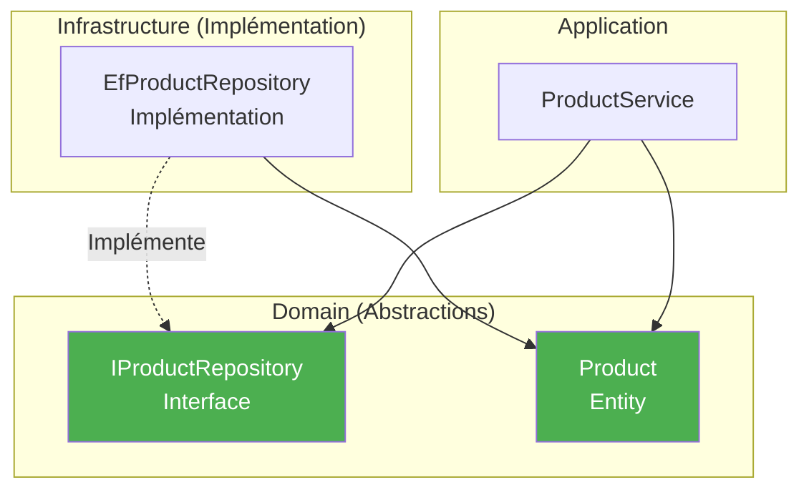

# Domain - Interfaces

## Vue d'ensemble

Les **interfaces** définissent les contrats que l'Infrastructure doit implémenter, respectant le principe d'**inversion de dépendance**.

## Pattern Repository

Les interfaces de repositories sont définies dans le Domain mais implémentées dans l'Infrastructure.

### IProductRepository

```csharp
public interface IProductRepository
{
    /// <summary>
    /// Récupère tous les produits
    /// </summary>
    Task<IEnumerable<Product>> GetAllAsync();
    
    /// <summary>
    /// Récupère un produit par son identifiant
    /// </summary>
    Task<Product?> GetByIdAsync(Guid id);
    
    /// <summary>
    /// Ajoute un nouveau produit
    /// </summary>
    Task AddAsync(Product product);
    
    /// <summary>
    /// Met à jour un produit existant
    /// </summary>
    Task UpdateAsync(Product product);
    
    /// <summary>
    /// Supprime un produit
    /// </summary>
    Task DeleteAsync(Guid id);
}
```

### ISupplierRepository

```csharp
public interface ISupplierRepository
{
    Task<IEnumerable<Supplier>> GetAllAsync();
    Task<Supplier?> GetByIdAsync(Guid id);
    Task AddAsync(Supplier supplier);
    Task UpdateAsync(Supplier supplier);
    Task DeleteAsync(Guid id);
}
```

### IUserRepository

```csharp
public interface IUserRepository
{
    Task<IEnumerable<User>> GetAllAsync();
    Task<User?> GetByIdAsync(Guid id);
    Task AddAsync(User user);
    Task UpdateAsync(User user);
    Task DeleteAsync(Guid id);
}
```

### IOrderRepository

```csharp
public interface IOrderRepository
{
    Task<IEnumerable<Order>> GetAllAsync();
    Task<Order?> GetByIdAsync(Guid id);
    Task AddAsync(Order order);
    Task UpdateAsync(Order order);
    Task DeleteAsync(Guid id);
    
    // Méthodes spécifiques aux commandes
    Task<IEnumerable<Order>> GetByUserIdAsync(Guid userId);
    Task<IEnumerable<Order>> GetByDateRangeAsync(DateTime start, DateTime end);
}
```

## Principe d'Inversion de Dépendance (DIP)



**Avantage** : Le Domain et l'Application ne dépendent **jamais** de l'Infrastructure.

## Generic Repository Pattern (optionnel)

Pour éviter la répétition, on peut créer une interface générique :

```csharp
public interface IRepository<T> where T : class
{
    Task<IEnumerable<T>> GetAllAsync();
    Task<T?> GetByIdAsync(Guid id);
    Task AddAsync(T entity);
    Task UpdateAsync(T entity);
    Task DeleteAsync(Guid id);
}

// Puis spécialiser
public interface IProductRepository : IRepository<Product>
{
    // Méthodes spécifiques aux produits
    Task<IEnumerable<Product>> GetBySupplierId(Guid supplierId);
    Task<IEnumerable<Product>> GetActiveProducts();
}
```

## Utilisation dans les Services

```csharp
public class ProductService
{
    // Dépendance sur l'interface, pas l'implémentation
    private readonly IProductRepository _repository;
    
    public ProductService(IProductRepository repository)
    {
        _repository = repository;
    }
    
    public async Task<IEnumerable<ProductDto>> GetAllAsync()
    {
        // Le service ne sait pas comment les données sont stockées
        var products = await _repository.GetAllAsync();
        return products.Select(MapToDto);
    }
}
```

## Injection de Dépendances

Dans `Program.cs` :

```csharp
// Enregistrement de l'implémentation pour l'interface
builder.Services.AddScoped<IProductRepository, EfProductRepository>();
builder.Services.AddScoped<ISupplierRepository, EfSupplierRepository>();
builder.Services.AddScoped<IUserRepository, EfUserRepository>();
builder.Services.AddScoped<IOrderRepository, EfOrderRepository>();
```

ASP.NET Core injecte automatiquement les bonnes implémentations.

## Avantages du pattern

### 1. Testabilité

```csharp
// Dans les tests, on peut mocker l'interface
var mockRepo = new Mock<IProductRepository>();
mockRepo.Setup(r => r.GetAllAsync())
    .ReturnsAsync(new List<Product> { testProduct });

var service = new ProductService(mockRepo.Object);
var result = await service.GetAllAsync();

// Test sans toucher à la vraie base de données
```

### 2. Flexibilité

On peut changer d'implémentation sans modifier le code métier :

```csharp
// Production : Entity Framework
builder.Services.AddScoped<IProductRepository, EfProductRepository>();

// Tests : In-Memory
builder.Services.AddScoped<IProductRepository, InMemoryProductRepository>();

// Alternative : Dapper
builder.Services.AddScoped<IProductRepository, DapperProductRepository>();
```

### 3. Séparation des responsabilités

- **Domain** : Définit le contrat
- **Infrastructure** : Implémente le contrat
- **Application** : Utilise le contrat

## CQRS (optionnel)

Pour des applications plus complexes, on peut séparer lecture et écriture :

```csharp
// Commandes (écriture)
public interface IProductCommandRepository
{
    Task AddAsync(Product product);
    Task UpdateAsync(Product product);
    Task DeleteAsync(Guid id);
}

// Queries (lecture)
public interface IProductQueryRepository
{
    Task<IEnumerable<Product>> GetAllAsync();
    Task<Product?> GetByIdAsync(Guid id);
}
```

## Unit of Work Pattern (optionnel)

Pour gérer les transactions :

```csharp
public interface IUnitOfWork : IDisposable
{
    IProductRepository Products { get; }
    ISupplierRepository Suppliers { get; }
    IOrderRepository Orders { get; }
    
    Task<int> SaveChangesAsync();
}
```

## Navigation

- [Retour au Domain →](../architecture/domain.md)
- [Entités →](entities.md)
- [Repositories (Infrastructure) →](../infrastructure/repositories.md)
