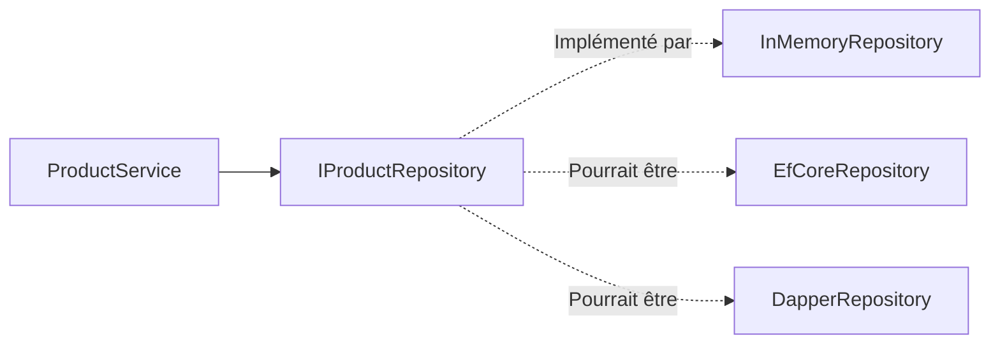

# Infrastructure - Repositories

## Vue d'ensemble

Les **repositories** sont les implémentations concrètes des interfaces définies dans le Domain pour la persistance des données.

## État actuel : In-Memory

⚠️ **Important** : Actuellement, les repositories utilisent des **collections en mémoire** (`List<T>`).

Les données sont **perdues au redémarrage** de l'application.

## Repositories disponibles

### EfProductRepository

Gestion de la persistance des produits.

```csharp
public class EfProductRepository : IProductRepository
{
    private readonly List<Product> _products = new();
    
    public async Task<IEnumerable<Product>> GetAllAsync()
    {
        return await Task.FromResult(_products.AsEnumerable());
    }
    
    public async Task<Product?> GetByIdAsync(Guid id)
    {
        return await Task.FromResult(_products.FirstOrDefault(p => p.Id == id));
    }
    
    public async Task AddAsync(Product product)
    {
        _products.Add(product);
        await Task.CompletedTask;
    }
    
    public async Task UpdateAsync(Product product)
    {
        var existing = _products.FirstOrDefault(p => p.Id == product.Id);
        if (existing != null)
        {
            _products.Remove(existing);
            _products.Add(product);
        }
        await Task.CompletedTask;
    }
    
    public async Task DeleteAsync(Guid id)
    {
        var product = _products.FirstOrDefault(p => p.Id == id);
        if (product != null)
        {
            _products.Remove(product);
        }
        await Task.CompletedTask;
    }
}
```

### EfSupplierRepository

```csharp
public class EfSupplierRepository : ISupplierRepository
{
    private readonly List<Supplier> _suppliers = new();
    
    // Mêmes méthodes CRUD
}
```

### EfUserRepository

```csharp
public class EfUserRepository : IUserRepository
{
    private readonly List<User> _users = new();
    
    // Mêmes méthodes CRUD
}
```

### EfOrderRepository

```csharp
public class EfOrderRepository : IOrderRepository
{
    private readonly List<Order> _orders = new();
    
    // Mêmes méthodes CRUD + méthodes spécifiques
    
    public async Task<IEnumerable<Order>> GetByUserIdAsync(Guid userId)
    {
        return await Task.FromResult(
            _orders.Where(o => o.UserId == userId).ToList()
        );
    }
}
```

## Pattern Repository

### Interface (Domain)

```csharp
// Défini dans Domain/Interfaces
public interface IProductRepository
{
    Task<IEnumerable<Product>> GetAllAsync();
    Task<Product?> GetByIdAsync(Guid id);
    Task AddAsync(Product product);
    Task UpdateAsync(Product product);
    Task DeleteAsync(Guid id);
}
```

### Implémentation (Infrastructure)

```csharp
// Implémenté dans Infrastructure/Repositories
public class EfProductRepository : IProductRepository
{
    // Implémentation concrète
}
```

## Injection de dépendances

Dans `Program.cs` :

```csharp
// L'application dépend de l'interface
builder.Services.AddScoped<IProductRepository, EfProductRepository>();

// On peut facilement changer l'implémentation
// builder.Services.AddScoped<IProductRepository, DapperProductRepository>();
// builder.Services.AddScoped<IProductRepository, MongoProductRepository>();
```

## Avantages du pattern

### 1. Abstraction de la persistance



### 2. Testabilité

```csharp
// Mock dans les tests
var mockRepo = new Mock<IProductRepository>();
mockRepo.Setup(r => r.GetAllAsync()).ReturnsAsync(testProducts);

var service = new ProductService(mockRepo.Object);
```

### 3. Changement de technologie facile

Remplacer `List<T>` par Entity Framework Core ne nécessite que de modifier les repositories.

## Migration vers Entity Framework Core

### 1. Installer les packages

```bash
dotnet add package Microsoft.EntityFrameworkCore
dotnet add package Microsoft.EntityFrameworkCore.SqlServer
```

### 2. Créer le DbContext

```csharp
public class AppDbContext : DbContext
{
    public DbSet<Product> Products { get; set; }
    public DbSet<Supplier> Suppliers { get; set; }
    public DbSet<User> Users { get; set; }
    public DbSet<Order> Orders { get; set; }
    
    public AppDbContext(DbContextOptions<AppDbContext> options) 
        : base(options)
    {
    }
    
    protected override void OnModelCreating(ModelBuilder modelBuilder)
    {
        // Configuration des entités
        modelBuilder.Entity<Product>()
            .OwnsOne(p => p.Price);
        
        modelBuilder.Entity<Product>()
            .OwnsOne(p => p.Vat);
    }
}
```

### 3. Modifier le repository

```csharp
public class EfProductRepository : IProductRepository
{
    private readonly AppDbContext _context;
    
    public EfProductRepository(AppDbContext context)
    {
        _context = context;
    }
    
    public async Task<IEnumerable<Product>> GetAllAsync()
    {
        return await _context.Products.ToListAsync();
    }
    
    public async Task<Product?> GetByIdAsync(Guid id)
    {
        return await _context.Products.FindAsync(id);
    }
    
    public async Task AddAsync(Product product)
    {
        await _context.Products.AddAsync(product);
        await _context.SaveChangesAsync();
    }
    
    public async Task UpdateAsync(Product product)
    {
        _context.Products.Update(product);
        await _context.SaveChangesAsync();
    }
    
    public async Task DeleteAsync(Guid id)
    {
        var product = await _context.Products.FindAsync(id);
        if (product != null)
        {
            _context.Products.Remove(product);
            await _context.SaveChangesAsync();
        }
    }
}
```

### 4. Configurer dans Program.cs

```csharp
builder.Services.AddDbContext<AppDbContext>(options =>
    options.UseSqlServer(
        builder.Configuration.GetConnectionString("DefaultConnection")
    )
);

builder.Services.AddScoped<IProductRepository, EfProductRepository>();
```

## Generic Repository (optionnel)

Pour éviter la duplication :

```csharp
public class GenericRepository<T> : IRepository<T> where T : class
{
    private readonly List<T> _entities = new();
    
    public async Task<IEnumerable<T>> GetAllAsync()
    {
        return await Task.FromResult(_entities.AsEnumerable());
    }
    
    // ... autres méthodes CRUD
}

// Utilisation
public class EfProductRepository : GenericRepository<Product>, IProductRepository
{
    // Méthodes spécifiques aux produits seulement
}
```

## Best Practices

### ✅ À faire

- **Un repository par agrégat** (Product, Order, etc.)
- Méthodes asynchrones (`async`/`await`)
- Injection du DbContext (quand EF Core)
- Méthodes spécifiques au domaine

```csharp
Task<IEnumerable<Product>> GetActiveProducts();
Task<IEnumerable<Product>> GetBySupplierId(Guid supplierId);
```

### ❌ À éviter

- Logique métier dans les repositories
- Exposition du DbContext à l'extérieur
- Requêtes LINQ complexes (à mettre dans des méthodes dédiées)

## Navigation

- [Retour à Infrastructure →](../architecture/infrastructure.md)
- [Interfaces (Domain) →](../domain/interfaces.md)
- [Configuration (future) →](configuration.md)
