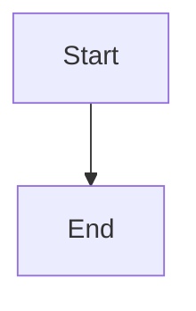

# 📚 Documentation MkDocs - AdvancedDevSample

> **Documentation complète du projet hébergée sur GitHub Pages**

---

## 🌐 Accès à la Documentation

**URL Publique :** [https://gauthier-damien.github.io/AdvancedDevSample/](https://gauthier-damien.github.io/AdvancedDevSample/)

!!! success "Documentation en ligne"
    La documentation est automatiquement déployée sur GitHub Pages à chaque push sur la branche `Docs`.

---

## 📁 Structure de la Documentation

```
docs/
├── index.md                          # Page d'accueil
├── getting-started/
│   ├── installation.md               # Guide d'installation
│   ├── quick-start.md                # Démarrage rapide
│   └── swagger-testing.md            # Tests avec Swagger
├── architecture/
│   ├── overview.md                   # Vue d'ensemble
│   ├── clean-architecture.md         # Clean Architecture
│   ├── domain-layer.md               # Couche Domain
│   ├── application-layer.md          # Couche Application
│   ├── infrastructure-layer.md       # Couche Infrastructure
│   └── api-layer.md                  # Couche API
├── api/
│   ├── authentication.md             # Authentification JWT
│   ├── products.md                   # Endpoints Products
│   ├── orders.md                     # Endpoints Orders
│   ├── users.md                      # Endpoints Users
│   └── suppliers.md                  # Endpoints Suppliers
├── guides/
│   ├── jwt-testing.md                # Tests JWT
│   ├── unit-testing.md               # Tests unitaires
│   ├── integration-testing.md        # Tests d'intégration
│   └── contributing.md               # Guide de contribution
├── quality/
│   ├── sonarcloud.md                 # SonarCloud
│   ├── github-actions.md             # CI/CD
│   ├── sonarqube-review.md           # Review SonarQube
│   └── sonarqube-review/             # 📸 Captures d'écran
│       ├── README.md
│       └── .gitkeep
└── audits/
    ├── audit-2026.md                 # Audit complet 2026
    ├── synthese.md                   # Synthèse
    └── history.md                    # Historique
```

---

## 🚀 Déploiement Automatique

### GitHub Actions Workflow

Le workflow `.github/workflows/deploy-docs.yml` déploie automatiquement la documentation :

**Déclencheurs :**
- ✅ Push sur branche `Docs`
- ✅ Déclenchement manuel (workflow_dispatch)

**Processus :**
1. Checkout du code
2. Installation de Python 3.x
3. Installation de MkDocs Material + plugins
4. Build de la documentation (`mkdocs build`)
5. Déploiement sur branche `gh-pages`
6. Publication sur GitHub Pages

**Durée :** ~2-3 minutes

---

## 🛠️ Développement Local

### Prérequis

```bash
# Installer Python 3.x
python --version

# Installer MkDocs et plugins
pip install mkdocs-material
pip install mkdocs-mermaid2-plugin
```

### Commandes

```bash
# Prévisualiser la documentation en local
mkdocs serve

# Ouvrir http://127.0.0.1:8000
# Les changements sont rechargés automatiquement

# Build de la documentation
mkdocs build

# Déployer manuellement sur GitHub Pages
mkdocs gh-deploy
```

---

## 📝 Configuration

### mkdocs.yml

Le fichier de configuration principal se trouve à la racine du projet.

**Thème :** Material for MkDocs  
**Langue :** Français  
**Plugins :**
- search (recherche)
- mermaid2 (diagrammes)

**Extensions Markdown :**
- Admonitions (notes, warnings, tips)
- Code highlighting
- Tables
- Tabs
- Task lists
- Emoji
- Mermaid diagrams

---

## 📸 Dossier SonarQube Review

Le dossier `docs/quality/sonarqube-review/` est prêt pour recevoir vos captures d'écran :

### Images à ajouter

1. `dashboard-overview.png` - Vue d'ensemble SonarCloud
2. `quality-gate.png` - Status du Quality Gate
3. `coverage.png` - Couverture de code
4. `bugs.png` - Bugs détectés
5. `vulnerabilities.png` - Vulnérabilités
6. `code-smells.png` - Code smells
7. `security-rating.png` - Security rating
8. `history-quality.png` - Évolution qualité
9. `history-coverage.png` - Évolution couverture

### Comment ajouter des images

1. Prendre des captures du [Dashboard SonarCloud](https://sonarcloud.io/project/overview?id=Gauthier-Damien_AdvancedDevSample)
2. Sauvegarder dans `docs/quality/sonarqube-review/`
3. Référencer dans `docs/quality/sonarqube-review.md` :
   ```markdown
   
   ```

---

## ✅ Checklist de Mise à Jour

### Avant de pusher sur Docs

- [ ] Tous les fichiers .md référencés dans `mkdocs.yml` existent
- [ ] Les liens internes fonctionnent
- [ ] Les images ont des chemins corrects
- [ ] Test local : `mkdocs serve` fonctionne
- [ ] Build local : `mkdocs build` sans erreur

### Après le push

- [ ] Vérifier le workflow GitHub Actions (onglet Actions)
- [ ] Vérifier que le déploiement réussit
- [ ] Tester la documentation sur GitHub Pages
- [ ] Vérifier que les images s'affichent

---

## 🎨 Personnalisation

### Thème Material

Le thème Material offre :
- Mode clair / Mode sombre
- Navigation par onglets
- Recherche intégrée
- Responsive design
- Code highlighting
- Icônes Material Design

### Couleurs

Configuré dans `mkdocs.yml` :
```yaml
theme:
  palette:
    primary: deep purple
    accent: purple
```

---

## 📊 Métriques

### Pages de Documentation

| Section | Nombre de pages | Statut |
|---------|----------------|--------|
| **Accueil** | 1 | ✅ Créée |
| **Getting Started** | 3 | ⚠️ En cours |
| **Architecture** | 6 | ⚠️ À créer |
| **API** | 5 | ⚠️ À créer |
| **Guides** | 4 | ⚠️ À créer |
| **Quality** | 3 | ✅ Créée |
| **Audits** | 3 | ⚠️ À migrer |
| **Total** | **25 pages** | 20% complété |

---

## 🔗 Ressources

- [MkDocs Documentation](https://www.mkdocs.org/)
- [Material for MkDocs](https://squidfunk.github.io/mkdocs-material/)
- [Mermaid Diagrams](https://mermaid-js.github.io/)
- [Markdown Guide](https://www.markdownguide.org/)

---

## ❓ FAQ

### Comment ajouter une nouvelle page ?

1. Créer le fichier .md dans le dossier approprié
2. Ajouter l'entrée dans `mkdocs.yml` section `nav:`
3. Commit et push sur branche `Docs`

### Comment ajouter un diagramme ?

Utiliser Mermaid :
````markdown

````

### Comment ajouter une note/warning ?

```markdown
!!! note "Titre"
    Contenu de la note

!!! warning "Attention"
    Contenu de l'avertissement

!!! tip "Astuce"
    Contenu de l'astuce

!!! success "Succès"
    Contenu du succès
```

---

!!! success "Documentation MkDocs Configurée"
    ✅ Structure créée  
    ✅ Workflow GitHub Actions configuré  
    ✅ Dossier SonarQube Review prêt  
    ✅ Prêt pour déploiement sur GitHub Pages

---

*Dernière mise à jour : 10 février 2026*
