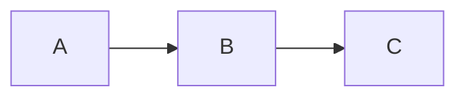

# Documentation MkDocs - AdvancedDevSample

## 🚀 Déploiement de la documentation

### Prérequis

- Python 3.8+
- pip

### Installation

Les dépendances sont déjà installées. Si nécessaire :

```bash
pip install -r requirements.txt
```

## 📖 Utilisation

### Serveur de développement

Lancer le serveur local avec rechargement automatique :

```bash
mkdocs serve
```

La documentation sera accessible sur : **http://127.0.0.1:8000**

Le serveur se recharge automatiquement à chaque modification des fichiers `.md`.

### Construction du site statique

Générer les fichiers HTML statiques :

```bash
mkdocs build
```

Les fichiers seront générés dans le dossier `site/`.

### Déploiement sur GitHub Pages

```bash
mkdocs gh-deploy
```

Cela construit et déploie automatiquement sur la branche `gh-pages`.

## 📁 Structure de la documentation

```
Docs/
├── index.md                      # Page d'accueil
├── api/
│   ├── introduction.md           # Introduction API
│   ├── endpoints.md              # Liste des endpoints
│   ├── controllers.md            # Documentation des controllers
│   └── middlewares.md            # Middlewares utilisés
├── architecture/
│   ├── overview.md               # Vue d'ensemble
│   ├── domain.md                 # Couche Domain
│   ├── application.md            # Couche Application
│   ├── infrastructure.md         # Couche Infrastructure
│   └── api.md                    # Couche API
├── development/
│   ├── installation.md           # Guide d'installation
│   ├── configuration.md          # Configuration
│   └── best-practices.md         # Bonnes pratiques
└── tests/
    ├── unit-tests.md             # Tests unitaires
    └── integration-tests.md      # Tests d'intégration
```

## ✏️ Modification de la documentation

### Créer une nouvelle page

1. Créer un fichier `.md` dans `Docs/`
2. Ajouter la page dans `mkdocs.yml` sous `nav:`

```yaml
nav:
  - Accueil: index.md
  - Ma nouvelle page: ma-page.md
```

### Syntaxe Markdown

#### Titres

```markdown
# Titre niveau 1
## Titre niveau 2
### Titre niveau 3
```

#### Liens

```markdown
[Texte du lien](chemin/vers/page.md)
```

#### Code

````markdown
```csharp
public class Example
{
    // Code C#
}
```
````

#### Diagrammes Mermaid

````markdown

````

#### Admonitions

```markdown
!!! note "Titre de la note"
    Contenu de la note

!!! warning "Attention"
    Message d'avertissement

!!! tip "Astuce"
    Conseil utile
```

## 🎨 Personnalisation du thème

Modifier `mkdocs.yml` :

```yaml
theme:
  name: material
  palette:
    primary: indigo  # Couleur principale
    accent: indigo   # Couleur d'accentuation
```

Couleurs disponibles : red, pink, purple, indigo, blue, cyan, teal, green, lime, yellow, amber, orange, deep-orange

## 🔧 Configuration

### Fichier `mkdocs.yml`

Configuration principale du site :

- **site_name** : Nom du site
- **theme** : Configuration du thème Material
- **nav** : Structure de navigation
- **plugins** : Extensions activées
- **markdown_extensions** : Extensions Markdown

## 📦 Extensions activées

- **pymdownx.highlight** : Coloration syntaxique
- **pymdownx.superfences** : Support Mermaid
- **admonition** : Boîtes d'information
- **tables** : Tableaux
- **toc** : Table des matières

## 🌐 Déploiement en production

### Option 1 : GitHub Pages

```bash
mkdocs gh-deploy
```

### Option 2 : Netlify

1. Connecter le repository GitHub
2. Build command : `mkdocs build`
3. Publish directory : `site`

### Option 3 : Serveur statique

```bash
mkdocs build
# Copier le dossier site/ sur votre serveur
```

## 📚 Ressources

- [Documentation MkDocs](https://www.mkdocs.org/)
- [Material for MkDocs](https://squidfunk.github.io/mkdocs-material/)
- [Markdown Guide](https://www.markdownguide.org/)
- [Mermaid Diagrams](https://mermaid.js.org/)

## 🔍 Commandes utiles

```bash
# Serveur de développement
mkdocs serve

# Build
mkdocs build

# Build avec mode verbeux
mkdocs build --verbose

# Nettoyer le dossier site/
mkdocs build --clean

# Déployer sur GitHub Pages
mkdocs gh-deploy

# Vérifier la configuration
mkdocs build --strict
```

## ✅ Checklist avant déploiement

- [ ] Toutes les pages sont créées
- [ ] Les liens internes fonctionnent
- [ ] Les diagrammes Mermaid s'affichent correctement
- [ ] La navigation est cohérente
- [ ] Le build passe sans warning
- [ ] Les images sont optimisées
- [ ] Les métadonnées sont remplies

---

**Auteur** : Gautier  
**Dernière mise à jour** : Février 2026
