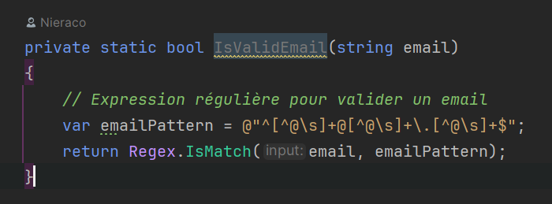
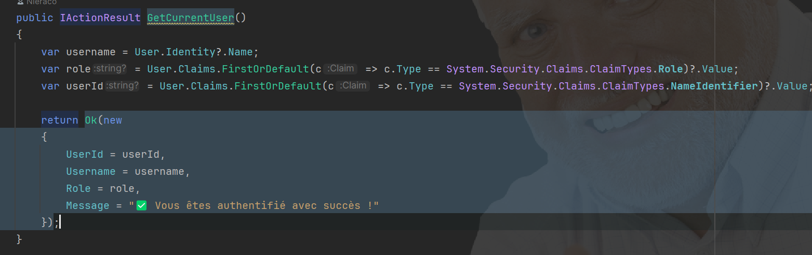

# Analyse SonarQube - Problèmes identifiés

## Problème 1 : Retirer la methode privée inutilisée

### 📸 Capture d'écran

### 📝 Description du problème

SonarQube signale que la méthode privée `IsValidEmail()` dans les classes `User.cs` et `Supplier.cs` n'est jamais utilisée et devrait être supprimée.

**Fichiers concernés :**
- `AdvancedDevSample.Domain/Entities/User.cs` (ligne 110)
- `AdvancedDevSample.Domain/Entities/Supplier.cs` (ligne 73)

### ⚖️ Décision

- [ ] ✅ Résolu
- [X] ❌ Non résolu

### 💡 Justification

ette méthode de validation d'email utilisant une expression régulière robuste a été intentionnellement conservée pour une évolution future du code.

## Problème 2 : ProducesResponseType manquant le type de retour 

### 📸 Capture d'écran

### 📝 Description du problème

SonarQube signale que l'attribut `[ProducesResponseType]` pour les réponses de succès (200 OK) doit contenir le type de retour explicite pour améliorer la documentation Swagger/OpenAPI.

**Fichier concerné :**
- `AdvancedDevSample.API/Controllers/AuthController.cs` (ligne 80)

### ⚖️ Décision

- [X] ✅ Résolu
- [ ] ❌ Non résolu

### 💡 Justification

Ajout du type de retour dans l'attribut ProducesResponseType :
[HttpGet("me")]
        [Authorize]
        **[ProducesResponseType(typeof(object), StatusCodes.Status200OK)] // AJOUTE**
        [ProducesResponseType(StatusCodes.Status401Unauthorized)]
        public IActionResult GetCurrentUser()
        {
            var username = User.Identity?.Name;
            var role = User.Claims.FirstOrDefault(c => c.Type == System.Security.Claims.ClaimTypes.Role)?.Value;
            var userId = User.Claims.FirstOrDefault(c => c.Type == System.Security.Claims.ClaimTypes.NameIdentifier)?.Value;

            return Ok(new
            {
                UserId = userId,
                Username = username,
                Role = role,
                Message = "✅ Vous êtes authentifié avec succès !"
            });
        }

Bénéfices :
- Meilleure documentation automatique de l'API
- IntelliSense plus précis pour les consommateurs de l'API
- Génération de clients HTTP plus fiable
- Conformité SonarQube respectée

